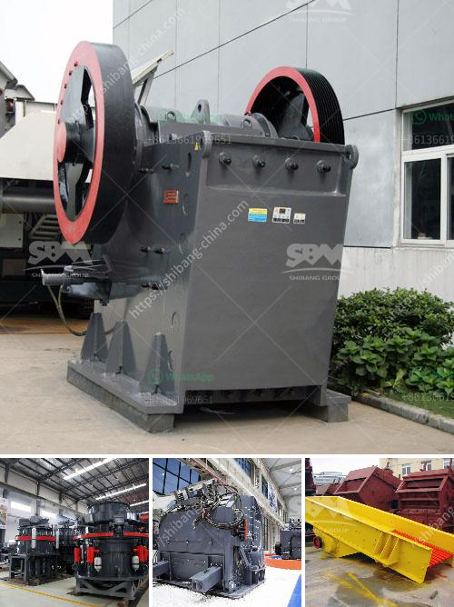

<h3>ball mill in aluminum plant equipments</h3>
Ball mill is a very important equipment in the aluminum powder production line. The function of the ball mill is to grind and mix various sizes of ore and grindable materials into a finer and uniform particle size. This process is also known as milling or comminution.

Ball mills are widely used in the production of cement, silicate products, new building materials, refractory materials, fertilizers, black and non-ferrous metal dressings and glass ceramics, dry or wet grinding of various ores and other grindable materials. The ball mill is suitable for grinding various ores and other materials.

In the aluminum powder production line, the ball mill grinds and mixes the aluminum fines into a uniform and fine powder for subsequent processing. This process not only reduces the particle size of the aluminum powder but also changes its morphology, increases the activity, and facilitates the subsequent processing of aluminum products.

The ball mill in the aluminum powder production line is mainly composed of a feeding system, a discharging system, a rotating part, a transmission system (reducer, small transmission gear, motor, electric control), and other parts. The hollow shaft is made of cast steel. The lining can be replaced. The rotating large gear is processed by casting hobbing, and the barrel body is inlaid with wear-resistant lining plates, which has good wear resistance.

In the production process of aluminum powder, the grinding operation is an important procedure. Grinding is an important process for aluminum powders that have undergone a certain degree of purification. The purpose of grinding is to increase the specific surface area of ​​the powder, make it contact fully with the materials to be fastened, thereby enhancing the activity of the powder, and improving the performance of the final product.

The ball mill has the characteristics of high grinding efficiency, high efficiency and energy saving, which changes the traditional mill structure, integrates the body, and under the same power, the output is increased by 10-30%. The roller press is combined with the ball mill to form a new grinding system, which simplifies the process, reduces the power consumption, and saves investment costs.

In addition, the ball mill in the aluminum plant can be equipped with other auxiliary equipment such as vibrating feeder, materials loading and unloading equipment, conveyor belt system, control system, etc., to improve the production efficiency and reduce manpower and material resources consumption.

In summary, the ball mill is a very important equipment in the aluminum plant equipment system. It plays a crucial role in the grinding and mixing operations. Achieving high production efficiency and improving product quality are the goals that every aluminum plant pursues. The use of advanced ball mill equipment can achieve these goals, making the aluminum plant well-equipped and the production process smooth.
<h3>Contact us</h3><ul><li><strong>Whatsapp:&nbsp;<a href="https://wa.me/8613661969651">+8613661969651</a></strong></li><li><a href="https://swt.shibang-china.com/?git&amp;zhl&amp;ball mill in aluminum plant equipments"><strong>Online Service(chat now)</strong></a></li></ul><h3>Related</h3><ul><li><a href='crushing asphalt with jaw crusher.md'>crushing asphalt with jaw crusher</a></li><li><a href='crusher dimensions crusher conica.md'>crusher dimensions crusher conica</a></li><li><a href='crusher machine price in kenya.md'>crusher machine price in kenya</a></li><li><a href='jaw crusher vs cone crusher.md'>jaw crusher vs cone crusher</a></li><li><a href='quarry processing plant.md'>quarry processing plant</a></li></ul>