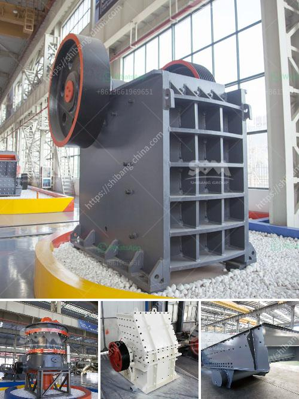

<h3>ball mill in turkey</h3>
Ball mill is a very important grinding equipment in the field of mineral processing. It is widely used in various industries such as cement, silicate products, new building materials, refractories, fertilizers, black and non-ferrous metal beneficiation, and glass ceramics. 

Turkey has abundant mineral resources, especially in recent years with the development of infrastructure construction, the demand for mineral processing equipment in Turkey is increasing. Turkey has a large number of ball mill manufacturers, producing various types of grinding equipment. The specifications and models of ball mills are also diverse, so the price of ball mills is different.

The ball mill we produce in Turkey has different specifications according to different fineness requirements. For example, the ball mill parameter of 2200×7000 is a typical equipment in the middle stage of the mine grinding. The ball mill produced by Zhengzhou Vanguard Machinery Technology Co., Ltd. has environmental protection, high efficiency, fine grain size and energy saving. It is a leading brand in the field of ball mills in Turkey.

Although the grinding technology of ball mill belongs to traditional grinding equipment, the power consumption of ball mill is still a concern for customers. To this end, we have been upgrading the energy-saving ball mill to improve its efficiency and reduce its power consumption. In addition to saving energy, we also pay attention to the environmental performance of the ball mill. We have adopted dust removal measures and noise reduction design to reduce pollution to the environment during the production process.

Vanguard Machinery is a professional ball mill manufacturer in Turkey, providing customers with high-quality ball mills and perfect after-sales service. Our ball mills have been exported to more than 80 countries and regions such as Russia, India, Indonesia, Turkey, Thailand, Egypt, Philippines, Zimbabwe, Pakistan, etc., and have won unanimous praise from customers at home and abroad. 

In conclusion, ball mill plays a crucial role in Turkey's mineral processing industry. With the continuous improvement of technology, the development of energy-saving and environmentally friendly ball mills is more and more popular. As a professional ball mill manufacturer, Vanguard Machinery is committed to providing customers with high-quality equipment and creating greater value for customers.
<h3>Contact us</h3><ul><li><strong>Whatsapp:&nbsp;<a href="https://wa.me/8613661969651">+8613661969651</a></strong></li><li><a href="https://swt.shibang-china.com/?git&amp;zhl&amp;ball mill in turkey"><strong>Online Service(chat now)</strong></a></li></ul><h3>Related</h3><ul><li><a href='stone crusher machine price kenya.md'>stone crusher machine price kenya</a></li><li><a href='vertical roller mill manufacture in tamilnadu.md'>vertical roller mill manufacture in tamilnadu</a></li><li><a href='calcium carbonate machine.md'>calcium carbonate machine</a></li><li><a href='used stone crushers for sale in accra.md'>used stone crushers for sale in accra</a></li><li><a href='concrete crushing equipment.md'>concrete crushing equipment</a></li></ul>