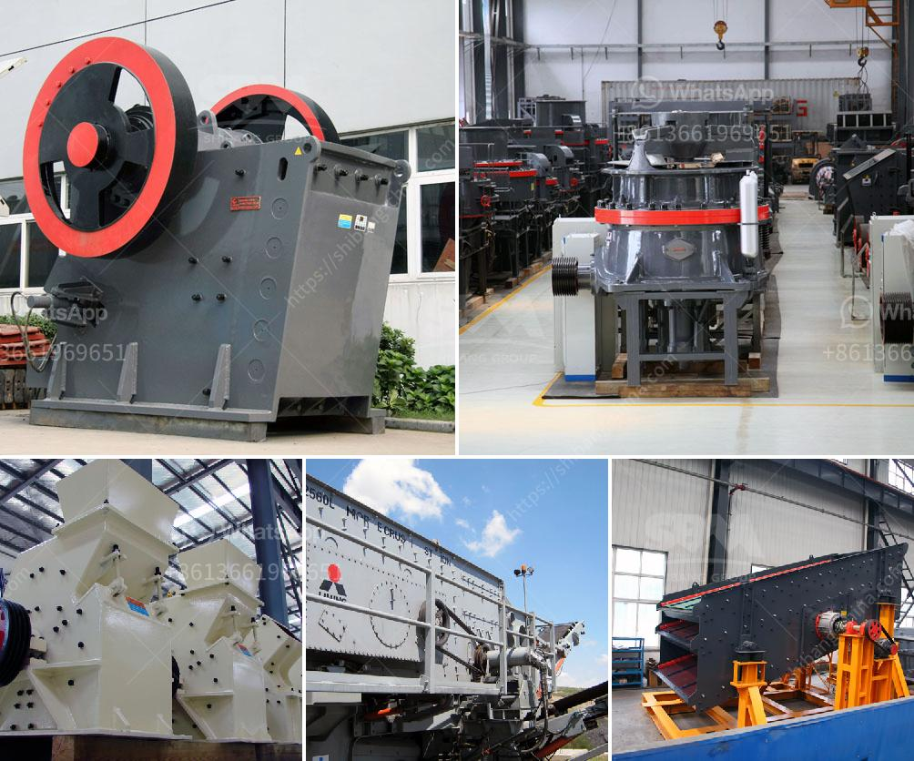

<h3>ball mill in zimbabwe</h3>
Ball mill plays an essential role in the mineral processing production line. So, it is very important to improve the production capacity of ball mill for the users. The purpose of the ball mill is to grind the materials to qualified particle size. Depending on more than 20 years of project experience, we have established a set of optimized ball mill selection and configuration scheme. Considering the factors of the customer's production site, material characteristics, and other requirements, we have put forward a set of optimized ball mill selection and configuration for Zimbabwe customers.

Firstly, we have conducted a thorough investigation of the customer’s mineral properties and requirements. The results show that the main minerals in the customer's ore are gold, copper, and antimony. The grain size of gold particles in the ore is relatively large, while the copper and antimony minerals are mainly distributed in the fine-grained part. Considering the high hardness of the customer’s ore, the selection of the grinding medium and the lining plate of the ball mill are also crucial.

In terms of the grinding medium, we recommend using the high-chromium steel balls with a diameter of 50-80mm. They have good wear resistance and impact toughness, which can effectively reduce the consumption of grinding media and improve the production efficiency of the ball mill.

To improve the grinding efficiency, the linings of the ball mill are made of wear-resistant materials. We use high-quality rubber as the main material of the lining plate. The advantages of rubber linings are as follows:

1. Rubber linings have excellent wear resistance and impact resistance. They can effectively reduce the wear of the lining plate and prolong the service life of the ball mill.

2. Rubber linings are easy to install and replace, which can save maintenance time and reduce maintenance costs.

Based on the analysis of the customer's mineral properties and requirements, we recommend a φ1500×4500 ball mill for the customer. This ball mill is a horizontal cylinder rotating device with outer gear transmission. The material enters the first chamber of the ball mill evenly by the feeding device through the hollow shaft of the feeding material. The chamber has stepped lining or corrugated lining, which is filled with steel balls of different specifications. The centrifugal force generated by the rotation of the cylinder brings the steel balls to a certain height and then falls down, which has a heavy impact and grinding effect on the materials. After coarse grinding, the material enters the second chamber through the single-layer partition plate. The chamber is equipped with a flat lining plate and steel balls for further grinding. Finally, the qualified products are discharged through the discharge grate plate to complete the grinding process.

In conclusion, with the optimized selection of grinding medium, lining plate, and the reasonable selection and configuration of the ball mill, the production capacity of the ball mill can be greatly improved. This is especially important for minerals with high hardness or fine-grained distribution. With a customized and optimized ball mill, Zimbabwe's mineral processing production line can achieve higher efficiency and greater economic benefits.
<h3>Contact us</h3><ul><li><strong>Whatsapp:&nbsp;<a href="https://wa.me/8613661969651">+8613661969651</a></strong></li><li><a href="https://swt.shibang-china.com/?git&amp;zhl&amp;ball mill in zimbabwe"><strong>Online Service(chat now)</strong></a></li></ul><h3>Related</h3><ul><li><a href='limestone ball mill machine.md'>limestone ball mill machine</a></li><li><a href='diamond dms plant for sale south africa.md'>diamond dms plant for sale south africa</a></li><li><a href='lime stone powder making machine in india.md'>lime stone powder making machine in india</a></li><li><a href='new crushing machines in oman.md'>new crushing machines in oman</a></li><li><a href='sayaji stone crusher machine.md'>sayaji stone crusher machine</a></li></ul>