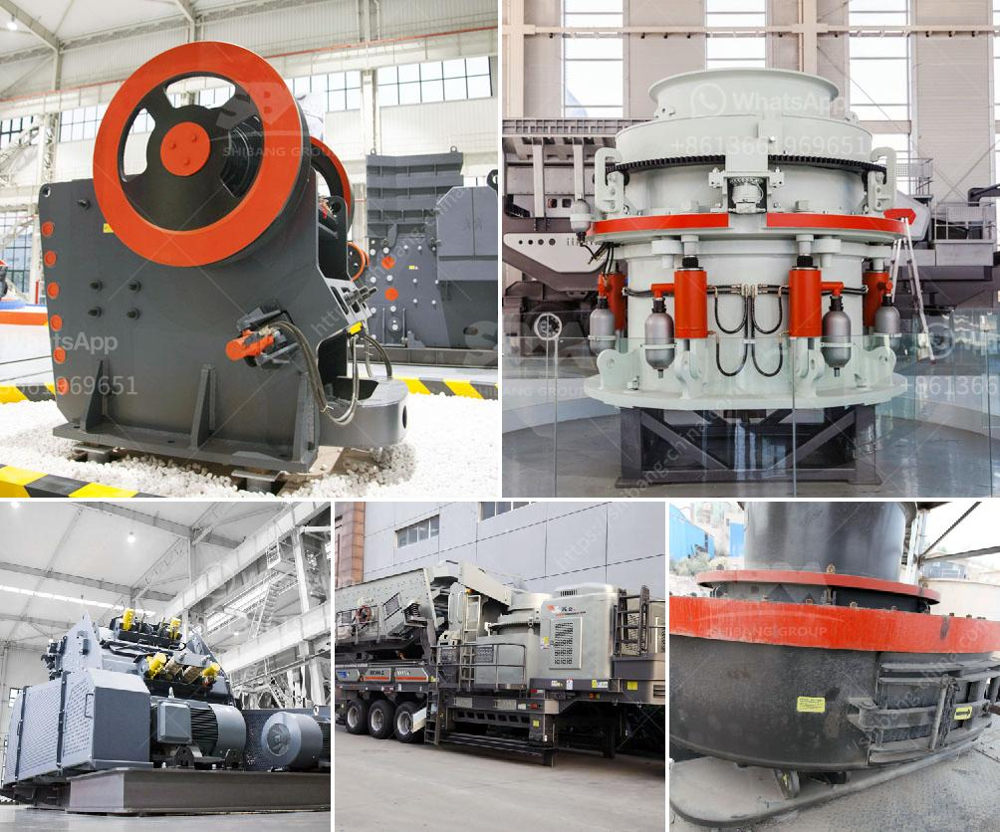

<h3>ball mill india india</h3>
India is a renowned producer of a wide range of industrial and consumer goods. With the advancement of technology, Indian manufacturers have entered into the global market, producing high-quality products that meet international standards. One such industry that is growing in prominence in India is the ball mill industry. Ball mills are increasingly being used for the size reduction of bulk materials.

A ball mill is a type of grinder used to grind and blend materials for use in mineral dressing processes, paints, pyrotechnics, ceramics, and selective laser sintering. It works on the principle of impact and attrition: size reduction is done by impact as the balls drop from near the top of the shell. A ball mill consists of a hollow cylindrical shell rotating about its axis. The axis of the shell may be either horizontal or at a small angle to the horizontal. The grinding media is the balls, which may be made of steel, stainless steel, ceramic, or rubber.

India has a long history of manufacturing ball mills, with its existence dating back to the early 19th century. The company has evolved over the years and today, is one of the most renowned ball mill manufacturers in India. For further strengthening the idea of 'Make in India' initiative, the company has had several strategic tie-ups with leading international companies, resulting in the transfer of state-of-the-art manufacturing technology.

The ball mill industry plays a crucial role in the overall development of the country. The advantages offered by the ball mills are numerous. The ball mills reduce the material to a fine powder or a specific size, making it suitable for various applications. This process is highly energy-efficient and consumes less power, which reduces the overall operating cost of the industry. Additionally, the ball mill industry is equipped with advanced technology that ensures efficient and precise processing of the materials.

With the increasing demand for high-quality products, the ball mill industry in India is thriving. The Indian market is flooded with different types of ball mills, each catering to specific industrial and consumer needs. The availability of diverse models and sizes ensures that the customers have a wide range of options to choose from.

Moreover, the ball mill industry in India is witnessing significant investments from both domestic and international players. This has led to the introduction of advanced manufacturing techniques and the development of innovative products. Indian manufacturers are continuously upgrading their infrastructure and adopting advanced technology to stay ahead in the competitive market.

Furthermore, the ball mill industry in India also promotes employment opportunities, contributing to the overall economic growth of the country. The industry provides direct employment to a considerable number of individuals, while also generating indirect employment for ancillary industries associated with ball mills manufacturing.

In conclusion, the ball mill industry in India has emerged as an integral part of the Indian economy. With its technological advancements, high-quality products, and employment opportunities, the industry has witnessed exponential growth. The 'Make in India' initiative has further strengthened the position of Indian manufacturers in the global market. As the demand for ball mills grows, the industry is poised to achieve greater success in the coming years.
<h3>Contact us</h3><ul><li><strong>Whatsapp:&nbsp;<a href="https://wa.me/8613661969651">+8613661969651</a></strong></li><li><a href="https://swt.shibang-china.com/?git&amp;zhl&amp;ball mill india india"><strong>Online Service(chat now)</strong></a></li></ul><h3>Related</h3><ul><li><a href='low productivity jaw crusher.md'>low productivity jaw crusher</a></li><li><a href='design drawings of a hammer mill.md'>design drawings of a hammer mill</a></li><li><a href='rock crusher for sale philippines.md'>rock crusher for sale philippines</a></li><li><a href='price pe 600 and 900 stone crusher.md'>price pe 600 and 900 stone crusher</a></li><li><a href='mining process of marble.md'>mining process of marble</a></li></ul>