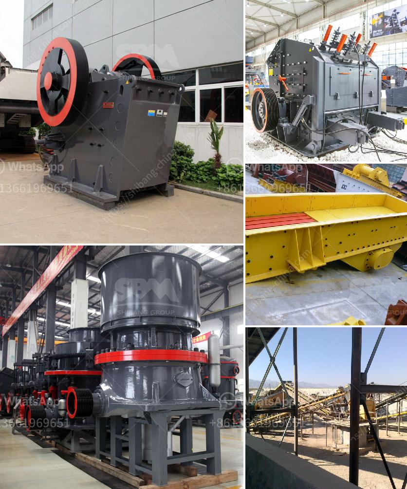

<h3>ball mill machine for powder</h3>
The ball mill machine is a key equipment for grinding materials and is widely used in powder-making production line including cement, silicate, new-type building material, refractory material, fertilizer, ore dressing of ferrous metal and non-ferrous metal, glass ceramics, etc. Ball mill for powders plays an increasingly important role in various industries such as cement, metallurgy, chemical industry, power generation, etc.

The ball mill machine consists of a rotating drum filled with balls. The materials to be ground are fed into the drum and grind by the impact of the rotating balls and the friction between the balls and the materials. The ball mill machine can grind various ores and other materials, either wet or dry. There are two kinds of ball mill machine, grate type and overflow type, due to different ways of discharging material.

One of the advantages of the ball mill machine is that it can produce ultra-fine powder, which can achieve a fineness of up to 0.065mm. The ultra-fine powder can be used for various industrial applications such as cosmetics, paint, paper, plastics, rubber, construction materials, etc. Moreover, the ball mill machine can produce powder with uniform particle size and is easy to adjust the fineness of the finished product by adjusting the rotation speed of the ball mill machine or changing the grinding media.

In addition to grinding powders, the ball mill machine can also be used to mix materials or homogenize suspensions. It is widely used in the chemical industry to mix paints, pyrotechnics, ceramics, etc. The ball mill machine can also be used for dry and wet grinding of various ores and other grind-able materials.

Furthermore, the ball mill machine has the advantages of low energy consumption, high efficiency, and high stability. This makes it an ideal equipment for grinding powder in various industries. The ball mill machine is equipped with a certain number of steel balls as grinding media in its cylinder. Under the action of centrifugal force and friction, the balls in the cylinder rotate with the cylinder and produce a centrifugal force to raise the balls to a certain height and then fall down. The materials are continuously crushed, ground, and discharged out of the cylinder.

In conclusion, the ball mill machine is a type of grinding machine used to grind materials into extremely fine powder, and it has broad application prospects in industrial grinding. Moreover, the machine can be used for both dry and wet grinding, and it is commonly used in cement factories, silicate products, new building materials, refractory materials, fertilizers, black and non-ferrous metal dressings, and glass ceramics, among others. With its low energy consumption, high efficiency, and stable performance, the ball mill machine is a reliable choice for grinding powders.
<h3>Contact us</h3><ul><li><strong>Whatsapp:&nbsp;<a href="https://wa.me/8613661969651">+8613661969651</a></strong></li><li><a href="https://swt.shibang-china.com/?git&amp;zhl&amp;ball mill machine for powder"><strong>Online Service(chat now)</strong></a></li></ul><h3>Related</h3><ul><li><a href='fine powder grinding machine.md'>fine powder grinding machine</a></li><li><a href='clay aggregate machinery product.md'>clay aggregate machinery product</a></li><li><a href='ultrafine ball mills machine.md'>ultrafine ball mills machine</a></li><li><a href='river sand garnet processing machines.md'>river sand garnet processing machines</a></li><li><a href='zinc ash crusher machine required.md'>zinc ash crusher machine required</a></li></ul>