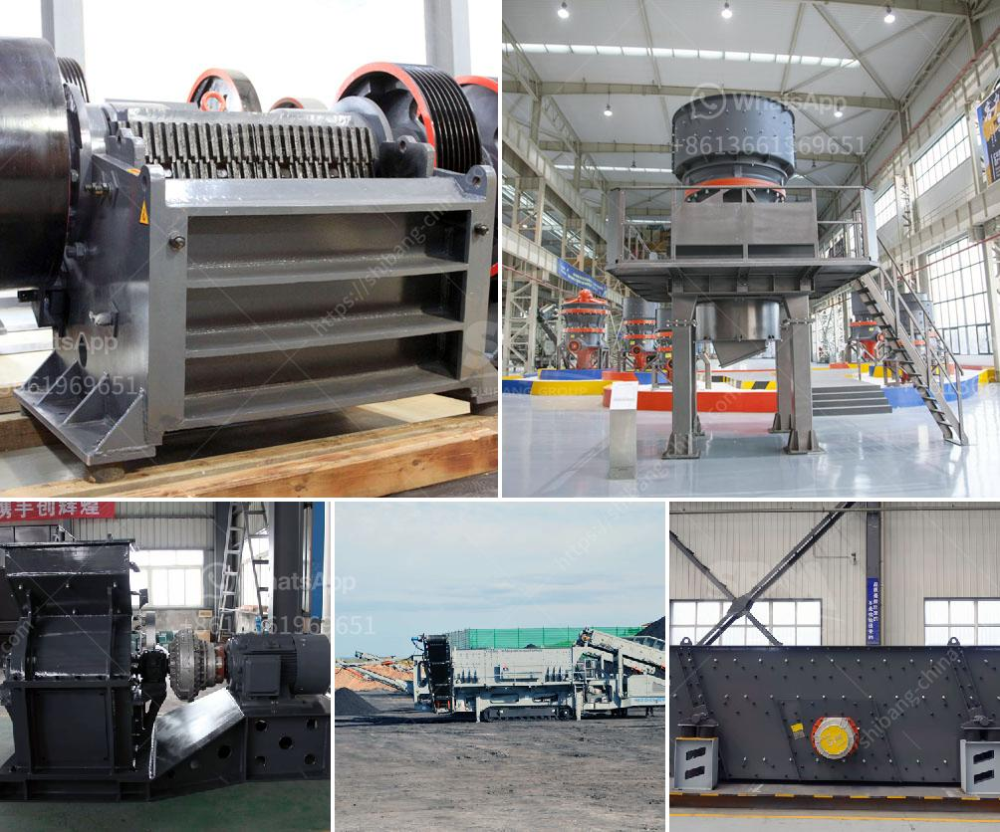

<h3>ball mill machine products from china</h3>
Ball mill machine is a common grinding equipment that is widely used in the mineral processing, building materials, silicate, chemical, and other industries. It is suitable for grinding all kinds of ore and other materials, which can be divided into dry and wet grinding. According to different working modes, it can be divided into overflow type and grate type.

Ball mill machine products from China have been sold to many countries and regions around the world, and customers are highly praised for their excellent performance and quality. The ball mill machine produced in China is a high-efficiency and energy-saving grinding equipment, which has a wide range of applications in various industries.

One of the advantages of the ball mill machine produced in China is that the structure is simple, the operation is easy, and the maintenance is convenient. The machine is composed of a feeding part, a discharging part, a turning part, and a transmission part. The hollow shaft is made of cast steel and the inner lining can be removed and replaced. The rotary gear is processed by casting hobbing, and the wear-resistant lining is used. The running smoothly and reliably.

Another advantage of the ball mill machine produced in China is that it has stable and reliable performance. The machine adopts a centralized control system, which can realize long-distance control and adjust the parameters remotely. The machine has strong adaptability to materials, and the fineness of the grinding can be adjusted within a wide range. In addition, it has the characteristics of low energy consumption, high production efficiency, low noise, and no pollution.

The ball mill machine products from China are widely used in various industries. In the mineral processing industry, they are used for grinding various ores such as iron ore, gold ore, copper ore, and lead-zinc ore. In the building materials industry, they are used for grinding various cement clinker and raw materials. In the chemical industry, they are used for grinding various chemical raw materials, fertilizers, and glass ceramics. The machine can also be used for dry grinding and wet grinding of other materials.

In summary, the ball mill machine products from China have high quality and reliable performance, and have been widely used in various industries. They are energy-saving and efficient grinding equipment. With their excellent performance, they have won the favor and trust of customers at home and abroad. As China's technology and manufacturing level continue to improve, the ball mill machine products from China will surely achieve greater development and bring more benefits to customers around the world.
<h3>Contact us</h3><ul><li><strong>Whatsapp:&nbsp;<a href="https://wa.me/8613661969651">+8613661969651</a></strong></li><li><a href="https://swt.shibang-china.com/?git&amp;zhl&amp;ball mill machine products from china"><strong>Online Service(chat now)</strong></a></li></ul><h3>Related</h3><ul><li><a href='sand and gravel crusher suppliers located in cebu.md'>sand and gravel crusher suppliers located in cebu</a></li><li><a href='calcium carbonate production.md'>calcium carbonate production</a></li><li><a href='china henan machinery small ball mill.md'>china henan machinery small ball mill</a></li><li><a href='stone crusher machine price kenya.md'>stone crusher machine price kenya</a></li><li><a href='hammer mill for 200 mesh powder.md'>hammer mill for 200 mesh powder</a></li></ul>