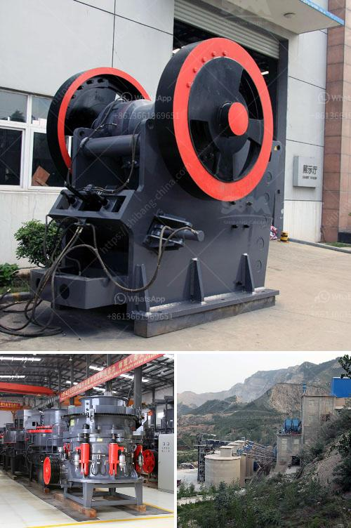

<h3>ball mill manufacturer for slag crushing</h3>
Ball mills are used in various industrial sectors to grind different materials. One of the popular industrial mills used for grinding is the ball mill. This machine is classified depending on the size of the particles being processed. Some of the industries that require the use of ball mills include cement industries, paint industries, mineral industries, and slag processing industries.

Slag is a by-product that is produced during the process of smelting ore. It is composed of various impurities and non-metallic compounds that are separated from the molten metal during the smelting process. Slag can be utilized in different ways, and one of its common uses is in construction.

In the construction industry, slag is extensively used as a substitute for conventional aggregates due to its properties. It is known to possess excellent binding properties, high compressive strength, and resistance to wear and tear. However, to convert raw slag into usable sizes, it needs to undergo a grinding process. This is where a ball mill manufacturer for slag crushing comes in.

The use of ball mills for grinding in the construction industry is not new. They have been extensively used to grind various raw materials like cement clinker, limestone, clay, and ore, among others. However, they have also been adapted to process materials like slag.

A ball mill manufacturer for slag crushing can provide different types of equipment, such as vertical roller mills, rod mills, and tube mills. These ball mills differ in size, capacity, and equipment components based on their designs. Rod mills, for example, are commonly used in slag crushing applications as they have lower operating costs and can grind finer particles compared to traditional ball mills.

When working with a ball mill manufacturer for slag crushing, it is essential to consider the type of ball mill to be used. The size and capacity of the ball mill should align with the requirements of the project. It is also crucial to ensure that the ball mill manufacturer has experience and expertise in handling slag. This ensures that the equipment is designed to efficiently and effectively grind the slag into the desired particle size.

Apart from the equipment, the ball mill manufacturer should provide comprehensive support and assistance throughout the project. This includes guidance on selecting the appropriate equipment, installation and maintenance support, and troubleshooting assistance. The manufacturer should also offer a reliable supply of spare parts to ensure continuous operation and minimal downtime.

In conclusion, a ball mill manufacturer for slag crushing plays a vital role in the construction industry. They provide the necessary equipment and support to convert raw slag into usable aggregates. When selecting a manufacturer, it is essential to consider factors such as the type of equipment, experience with slag processing, and overall customer support. By choosing the right manufacturer, construction companies can efficiently utilize slag and contribute to a more sustainable and cost-effective construction process.
<h3>Contact us</h3><ul><li><strong>Whatsapp:&nbsp;<a href="https://wa.me/8613661969651">+8613661969651</a></strong></li><li><a href="https://swt.shibang-china.com/?git&amp;zhl&amp;ball mill manufacturer for slag crushing"><strong>Online Service(chat now)</strong></a></li></ul><h3>Related</h3><ul><li><a href='cold roll mills in turkey.md'>cold roll mills in turkey</a></li><li><a href='cement machinery manufacturers in europe.md'>cement machinery manufacturers in europe</a></li><li><a href='mobile crushing plant price.md'>mobile crushing plant price</a></li><li><a href='used stone crushers for ballast sale.md'>used stone crushers for ballast sale</a></li><li><a href='impact crusher dealer.md'>impact crusher dealer</a></li></ul>