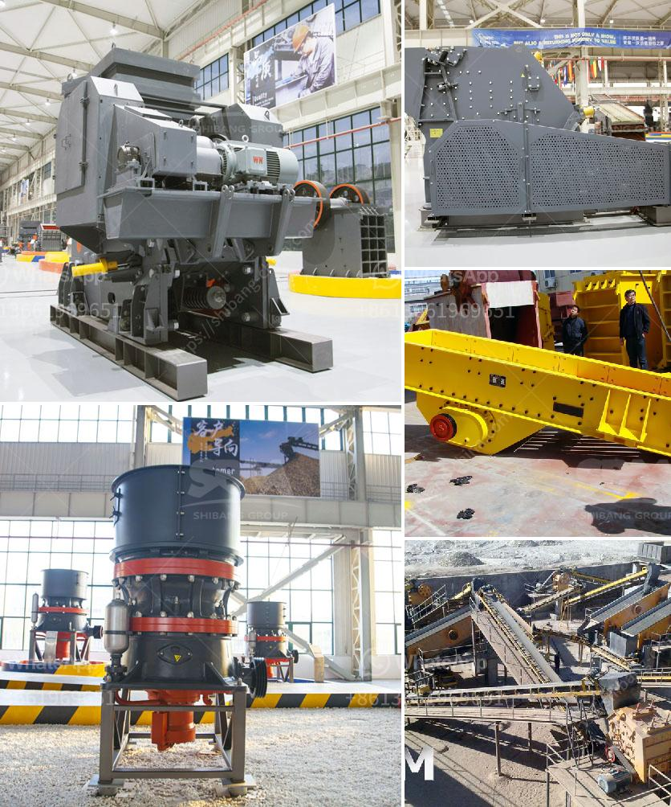

<h3>ball mill manufacturing manufacturing process</h3>
The ball mill manufacturing process is a complex, high-tech, and continuous process. Ball mills are widely used in various industries like mining, cement, and other heavy industries, but the working principle is the same, and it is mainly composed of the cylindrical shell with a certain proportion of spherical grinding media.

The grinding media are generally made of high-chromium steel or manganese steel, and with different sizes, and they are put into the mill drum after the complete loading. This grinding media remains in rotating mode, which imparts excellent grinding effect to the material within the mill drum. The grinding media are lifted up to a certain height and then fall down under the gravity, which will impact and grind the material after the repeated collisions.

The manufacturing process of the ball mill consists of two main stages. First, the material is fed into the mill drum through the feeding device and is finely ground by the falling grinding media. Secondly, the ground material is discharged through the discharging screen at the end of the mill drum. Besides, the ball mill can also be equipped with a classifier to meet the fineness requirements of different materials.

The manufacturing process begins with the selection of raw materials that make up the ball mill components, mainly composed of steel and concrete. After careful analysis of the desired properties of the ball mill, the materials are chosen accordingly. The raw materials are then shaped into the desired parts through various processes, including casting, forging, or welding.

In the casting process, molten metal is poured into molds, which are then cooled and removed to reveal the solidified parts. This method offers high flexibility and the ability to manufacture complex shapes. However, it may result in some porosities or irregularities in the final product.

Alternatively, steel parts can also be forged, which involves applying high pressure to deform the metal into the desired shape. This method offers better control over material properties and can produce stronger and more durable components. However, it is more time-consuming and expensive compared to casting.

Once the individual components are ready, they are assembled using welding techniques. Welding ensures the integrity and strength of the ball mill. The entire assembly undergoes quality checks to detect any defects or non-conformities before being tested for performance.

After the manufacturing process is completed, the ball mills are subjected to rigorous testing to ensure they meet the required specifications and standards. This includes checking the dimensions, hardness, and performance under various operating conditions.

In conclusion, the manufacturing process of ball mills involves multiple stages and intricate procedures, starting from the selection of raw materials to the final assembly and testing. The high-tech nature of the process ensures that the ball mills are reliable, efficient, and durable, making them essential equipment in various industries.
<h3>Contact us</h3><ul><li><strong>Whatsapp:&nbsp;<a href="https://wa.me/8613661969651">+8613661969651</a></strong></li><li><a href="https://swt.shibang-china.com/?git&amp;zhl&amp;ball mill manufacturing manufacturing process"><strong>Online Service(chat now)</strong></a></li></ul><h3>Related</h3><ul><li><a href='raymond mill supplier.md'>raymond mill supplier</a></li><li><a href='clay grinding mill machine price in china.md'>clay grinding mill machine price in china</a></li><li><a href='continuous ball mill capacity 500 hr.md'>continuous ball mill capacity 500 hr</a></li><li><a href='sell old stone crusher.md'>sell old stone crusher</a></li><li><a href='granite rock crusher.md'>granite rock crusher</a></li></ul>