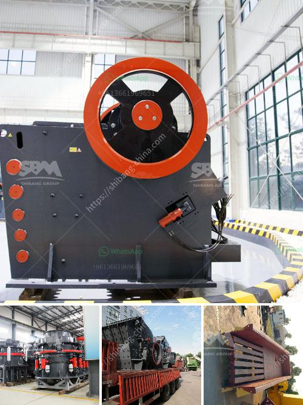

<h3>ball mill modual continuous ball mill</h3>
A ball mill is a type of grinder used to grind materials into extremely fine powder for use in mineral dressing processes, paints, pyrotechnics, ceramics, and selective laser sintering. The modular design of the ball mill allows for the integration of multiple modules into a full circuit, ranging from primary and secondary crushing through to ball milling and classification.

One popular implementation of modular ball mills is the continuous ball mill. This type of mill operates 24/7, reducing downtime and improving overall plant efficiency. It is designed to handle multiple feed sizes and can grind materials of varying hardness to the required product size.

The continuous ball mill consists of a cylindrical shell mounted on a hollow trunnion, enclosed with a grate discharge. The material to be ground is fed into the mill through the feed chute, typically by gravity. As the mill rotates, the grinding media (balls) cascade and tumble onto the material, crushing and grinding it into fine particles.

The modular design of the continuous ball mill offers several advantages. Firstly, it allows for easy installation and transportation. The individual modules can be transported separately and then assembled on-site, reducing logistical challenges and costs. Additionally, the modular construction enables easy maintenance and replacement of worn or damaged components, minimizing downtime.

Furthermore, the modular design of the continuous ball mill allows for flexibility in terms of processing capacity. Additional modules can be added or removed to adjust the mill's capacity based on the plant's requirements. This scalability is particularly beneficial for mining operations, where production levels may vary over time.

The continuous ball mill is also well-suited for the grinding of heat-sensitive materials or those that may react with the grinding media. The mill operates at a lower temperature compared to traditional ball mills, minimizing the risk of overheating and ensuring the integrity of the material being processed.

In terms of energy efficiency, the continuous ball mill offers significant improvements. The modular design allows for the integration of advanced control systems and automation, optimizing the mill's performance. Energy-saving features such as variable speed drives and high-efficiency classifiers can be incorporated, reducing the overall energy consumption of the milling process.

Additionally, the continuous ball mill can be operated in a closed-circuit configuration, where the oversize material from the classifier is returned to the mill for further grinding. This ensures that the desired product size is achieved without overgrinding, improving overall grinding efficiency and reducing energy consumption.

In conclusion, the modular continuous ball mill offers numerous advantages in terms of installation, transportation, maintenance, flexibility, and energy efficiency. Its modular design allows for easy integration into existing circuits and scalability to meet changing production requirements. With its ability to handle a wide range of feed sizes and materials, the continuous ball mill is a versatile and efficient solution for various grinding applications.
<h3>Contact us</h3><ul><li><strong>Whatsapp:&nbsp;<a href="https://wa.me/8613661969651">+8613661969651</a></strong></li><li><a href="https://swt.shibang-china.com/?git&amp;zhl&amp;ball mill modual continuous ball mill"><strong>Online Service(chat now)</strong></a></li></ul><h3>Related</h3><ul><li><a href='conveyor belt for fly ash.md'>conveyor belt for fly ash</a></li><li><a href='suppliers of ball mill in bhopal.md'>suppliers of ball mill in bhopal</a></li><li><a href='vibration screen machine in pakistan.md'>vibration screen machine in pakistan</a></li><li><a href='stone crusher machine prices.md'>stone crusher machine prices</a></li><li><a href='materials hammer mill.md'>materials hammer mill</a></li></ul>