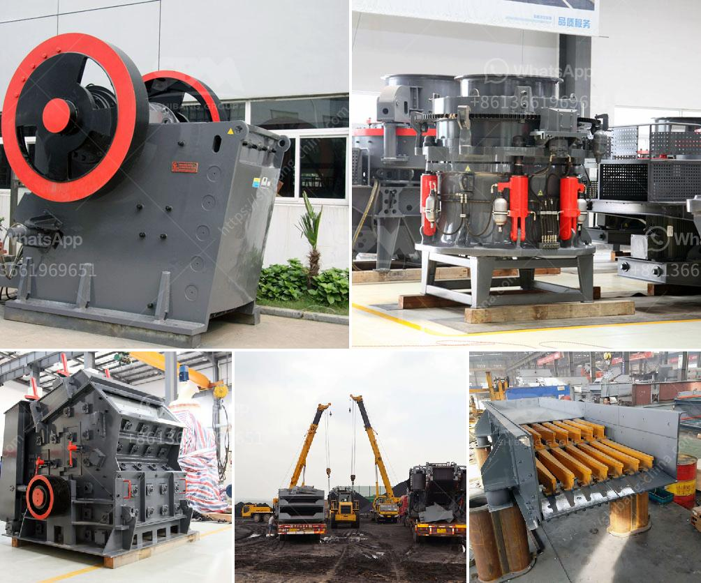

<h3>ball mill operation and maintenance manual pdf</h3>
A ball mill is a type of grinding mill which consists of a cylindrical shell partially filled with grinding media such as ceramic or metal balls. The ball mill is a key piece of equipment for grinding crushed materials, and it is widely used in production lines for powders such as cement, silicates, refractory material, fertilizer, glass ceramics, etc. as well as for ore dressing of both ferrous and non-ferrous metals.

The ball mill can grind various ores and other materials either wet or dry. There are two kinds of ball mill, grate type and overfall type due to different ways of discharging material. There are many types of grinding media suitable for use in a ball mill, each material having its own specific properties and advantages.

The operating principle of the ball mill consists of following steps. In a continuously operating ball mill, feed material fed through the central hole one of the caps into the drum and moves therealong, being exposed by grinding media. The material grinding occurs during impact falling grinding balls and abrasion the particles between the balls. Then, discharge of ground material performed through the central hole in the discharge cap or through the grid.

In this article, we mainly introduce the ball mill operation and maintenance manual. Ball mill maintenance consists of that in which the ball mill is one of the common equipment in the grinding and classification circuit in the beneficiation plant. It is mainly used for the grinding and processing of materials in the beneficiation process. It has a good grinding effect when processing certain minerals. 

Many users and investors will need a ball mill operation and maintenance manual with a view to ensuring proper operation of the ball mill and extending its service life. As a professional manufacturer of mining equipment, we are able to offer all-round mining solutions for our honored customers according to their practical situations and particular requirements. If you want to know more about the ball mill operation and maintenance manual, please feel free to contact us.
<h3>Contact us</h3><ul><li><strong>Whatsapp:&nbsp;<a href="https://wa.me/8613661969651">+8613661969651</a></strong></li><li><a href="https://swt.shibang-china.com/?git&amp;zhl&amp;ball mill operation and maintenance manual pdf"><strong>Online Service(chat now)</strong></a></li></ul><h3>Related</h3><ul><li><a href='the biggest crusher manufacturer in china.md'>the biggest crusher manufacturer in china</a></li><li><a href='lime dolomite plant processing.md'>lime dolomite plant processing</a></li><li><a href='china ball mill manufacturer.md'>china ball mill manufacturer</a></li><li><a href='aggregate crusher supplier.md'>aggregate crusher supplier</a></li><li><a href='china henan machinery small ball mill.md'>china henan machinery small ball mill</a></li></ul>