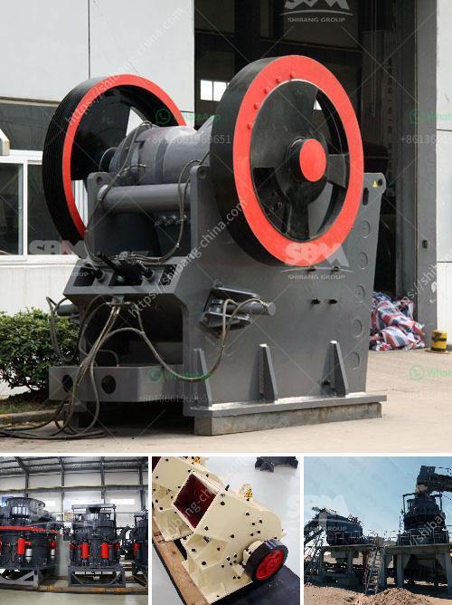

<h3>ball mill outpot capicity 180 tph</h3>
Ball mills are widely used in the production of cement, silicate products, new building materials, refractory materials, fertilizers, black and non-ferrous metal dressings, and glass ceramics, among others. They are essential equipment for grinding various ores and other grindable materials. The ball mill output capacity is an important factor in determining the efficiency and productivity of a particular grinding operation.

A ball mill's output capacity is measured in tph (tonnes per hour) and is determined by various factors such as the size of the grinding media, the speed of the mill, and the size of the discharge will result in a higher output. In this case, the ball mill has an output capacity of 180 tph, meaning it can grind 180 tonnes of material per hour.

To achieve optimal performance and maximize output capacity, several factors should be considered. Firstly, the size of the grinding media will affect the fineness and efficiency of the grinding operation. Smaller media leads to finer grind and higher output capacity. Secondly, the speed of the mill should be carefully controlled. By adjusting the rotational speed, the grinding process can be optimized, resulting in higher output. However, an excessively high speed can lead to excessive wear on the lining plates and increase energy consumption, so it is essential to find the right balance.

Furthermore, the size of the discharge opening also impacts the output capacity. A larger discharge opening allows for faster discharge of the ground material, contributing to higher throughput. Additionally, the feed size of the material being ground will affect the output capacity. Smaller particles can be ground more efficiently and produce a higher output.

In conclusion, the output capacity of a ball mill is crucial for determining its efficiency and productivity. With an output capacity of 180 tph, this ball mill can finely grind various materials to achieve the desired product size. By considering factors such as the size of the grinding media, mill speed, discharge opening, and feed size, the ball mill's output capacity can be optimized for peak performance.
<h3>Contact us</h3><ul><li><strong>Whatsapp:&nbsp;<a href="https://wa.me/8613661969651">+8613661969651</a></strong></li><li><a href="https://swt.shibang-china.com/?git&amp;zhl&amp;ball mill outpot capicity 180 tph"><strong>Online Service(chat now)</strong></a></li></ul><h3>Related</h3><ul><li><a href='used crusher in tanzania.md'>used crusher in tanzania</a></li><li><a href='cement grinding plants.md'>cement grinding plants</a></li><li><a href='portable crushing equipment.md'>portable crushing equipment</a></li><li><a href='roller mill ultrafine.md'>roller mill ultrafine</a></li><li><a href='quarry machine for sale.md'>quarry machine for sale</a></li></ul>