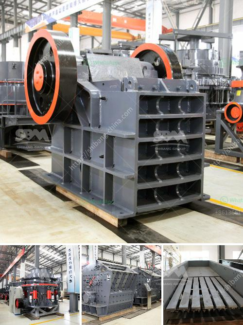

<h3>ball mill sale in malaysia</h3>
In recent years, Malaysia has witnessed a significant growth in the country's economy. With the development of various industries, mining and construction have become hot sectors, especially for ball mill sale in Malaysia.

Recently, there has been a surge in demand for mining machinery in Malaysia. Many local businesses are investing heavily in this sector and finding great success. One of the key equipment used by these industries is the ball mill.

Ball mills are a cylindrical device used in grinding or mixing materials like ores, chemicals, ceramic raw materials, and paints. They are widely used in the production of cement, silicate products, new building materials, fireproof materials, fertilizers, black and non-ferrous metal beneficiation, and glass ceramics, among others.

The sale of ball mills in Malaysia has seen rapid rise due to various factors, such as improved industrialization and the applications of these machines in the construction industry. Nowadays, ball mills are used extensively in cement plants, power generating stations, metallurgy, chemical industry, and many others.

Besides, ball mills are also used for the dispersing of highly viscous materials. Therefore, they find extensive use in the paint manufacturing industry as well.

Malaysia has a competitive advantage in the production of ball mills because it is located near the source of raw materials. Therefore, the impact of escalating fuel prices will be reduced, which can promote more affordable prices.

In conclusion, the sale of ball mills in Malaysia is a hot topic currently. These machines play a crucial role in the mining and construction industries, offering efficient and sustainable grinding solutions. The ball mill industry in Malaysia is expected to grow significantly in the coming years, as the country continues to expand its industrial footprint.
<h3>Contact us</h3><ul><li><strong>Whatsapp:&nbsp;<a href="https://wa.me/8613661969651">+8613661969651</a></strong></li><li><a href="https://swt.shibang-china.com/?git&amp;zhl&amp;ball mill sale in malaysia"><strong>Online Service(chat now)</strong></a></li></ul><h3>Related</h3><ul><li><a href='gold processing machinery in china.md'>gold processing machinery in china</a></li><li><a href='mining equipment companies in nigeria.md'>mining equipment companies in nigeria</a></li><li><a href='production process of gypsum.md'>production process of gypsum</a></li><li><a href='ethiopia gypsum machinery supplier.md'>ethiopia gypsum machinery supplier</a></li><li><a href='ballast processing plant.md'>ballast processing plant</a></li></ul>