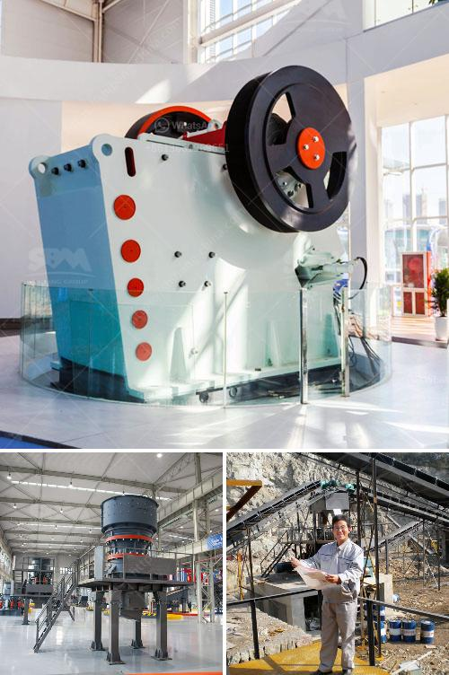

<h3>ball mill supplier in malaysia pakistan</h3>
Ball mill supplier in Malaysia Pakistan is one of the major cement producers in Malaysia. Being a developing country, Pakistan's infrastructure is also developing rapidly. This growth has led to a high demand for cement, which is an essential building material. The ball mill plays an important role in the cement manufacturing process. Therefore, ball mill suppliers have a significant impact on the success of the company.

Ball mill is one of the most popular and efficient grinding processes used in cement manufacturing. It ensures the smoothness of the cement making process by eliminating sudden fluctuations and disruptions in the raw material mixture. Ball mill suppliers in Malaysia Pakistan also provide services for repair, maintenance, and installation of ball mills.

Due to the high demand for cement in the region and the positive growth prospects for the industry, local cement manufacturers have increased their capacities in recent years. This has enhanced the demand for ball mill suppliers in Malaysia Pakistan. Cement industries are expected to grow at a steady CAGR throughout the forecast period, driven by the rising demand from the emerging markets such as India, China, and Southeast Asia.

Various factors contribute to the growth prospects of ball mill suppliers in Malaysia Pakistan. These include increasing investments in infrastructure projects, government initiatives to promote the construction industry, and the implementation of favorable trade policies. Moreover, the availability of raw materials and a skilled workforce in Malaysia Pakistan further enhances the growth of the industry.

To meet the high demand for cement, ball mill suppliers in Malaysia Pakistan have expanded their capacity and installed new equipment. These efforts have resulted in higher production capacity and efficiency. As a result, cement manufacturers look to ball mill suppliers Malaysia Pakistan for highly efficient processes and reliable equipment to meet the increasing demands of the industry.

In conclusion, the role of ball mill suppliers in Malaysia Pakistan cannot be ignored. They are crucial for cement manufacturers' success in the region. With the growing demand, these suppliers are expected to continue expanding their capacities and providing efficient solutions to meet the industry's requirements.
<h3>Contact us</h3><ul><li><strong>Whatsapp:&nbsp;<a href="https://wa.me/8613661969651">+8613661969651</a></strong></li><li><a href="https://swt.shibang-china.com/?git&amp;zhl&amp;ball mill supplier in malaysia pakistan"><strong>Online Service(chat now)</strong></a></li></ul><h3>Related</h3><ul><li><a href='equipments of copper processing.md'>equipments of copper processing</a></li><li><a href='how to crusher granite.md'>how to crusher granite</a></li><li><a href='slag crusher plant supplier india.md'>slag crusher plant supplier india</a></li><li><a href='caco3 carbonate calcium line production.md'>caco3 carbonate calcium line production</a></li><li><a href='complete gold mining equipment for small scale mines.md'>complete gold mining equipment for small scale mines</a></li></ul>