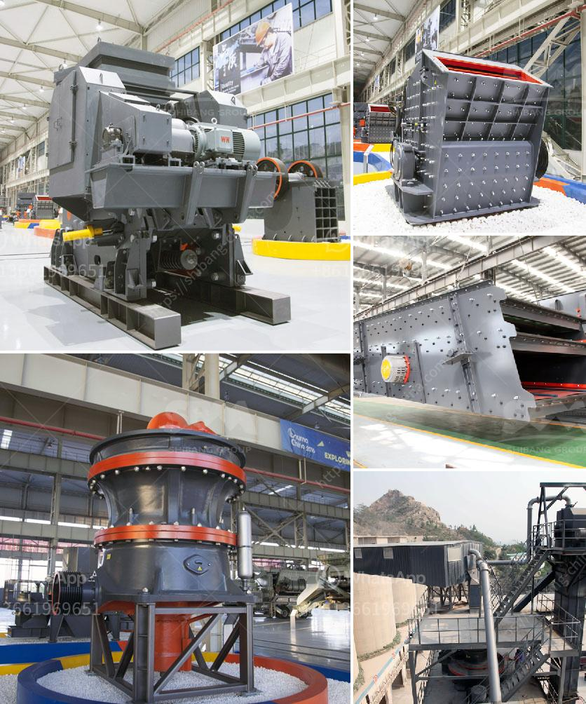

<h3>ball mill to crusher carbon charcoal</h3>
If you are involved in the charcoal production industry, then you may have come across the term "ball mill." This grinding machine is a versatile piece of equipment that allows you to crush and grind materials into fine powder. In the case of carbon charcoal, ball mills are used to reduce the particles' size making it easier to process and utilize them.

The process of converting carbon-rich materials like wood or agricultural waste into charcoal involves several steps, and grinding is an essential part of it. As the raw materials pass through the ball mill, they are repeatedly impacted and crushed by the grinding media (balls or rods) inside the mill. This mechanical action breaks down the carbon charcoal into smaller particles, increasing its surface area and making it more reactive.

The ball mill's grinding action also ensures a more thorough mixing of carbon charcoal with other ingredients used in the charcoal-making process. This helps in achieving a homogeneous mixture, essential for obtaining quality charcoal products. Moreover, by reducing the particle size, ball milling enhances the efficiency of subsequent processes like carbonization or activation.

One of the advantages of using a ball mill for carbon charcoal crushing is its versatility. These machines can handle a wide range of materials, from soft to hard and brittle. Additionally, they can be operated in a batch or continuous mode, depending on the specific requirements of your charcoal production process.

However, it is crucial to consider the ball mill's design and operating parameters to ensure optimal performance. Factors like the grinding media's size and composition, rotational speed, and milling time all play a role in achieving the desired particle size distribution and charcoal quality. Regular maintenance and monitoring of the ball mill are essential to prevent equipment failures and ensure consistent performance.

In conclusion, ball mills are valuable equipment in the charcoal production industry, allowing for efficient carbon charcoal crushing and grinding. The versatility and reliability of these machines make them indispensable for achieving high-quality charcoal products. So, if you are in the charcoal production business, investing in a reliable ball mill can be a game-changer, improving your overall production efficiency and product quality.
<h3>Contact us</h3><ul><li><strong>Whatsapp:&nbsp;<a href="https://wa.me/8613661969651">+8613661969651</a></strong></li><li><a href="https://swt.shibang-china.com/?git&amp;zhl&amp;ball mill to crusher carbon charcoal"><strong>Online Service(chat now)</strong></a></li></ul><h3>Related</h3><ul><li><a href='gold refining equipment toronto.md'>gold refining equipment toronto</a></li><li><a href='mobile crushing station.md'>mobile crushing station</a></li><li><a href='gypsum powder production line capacity 80 tons per hour.md'>gypsum powder production line capacity 80 tons per hour</a></li><li><a href='method statement for a barite mill.md'>method statement for a barite mill</a></li><li><a href='made in germany stone crusher.md'>made in germany stone crusher</a></li></ul>