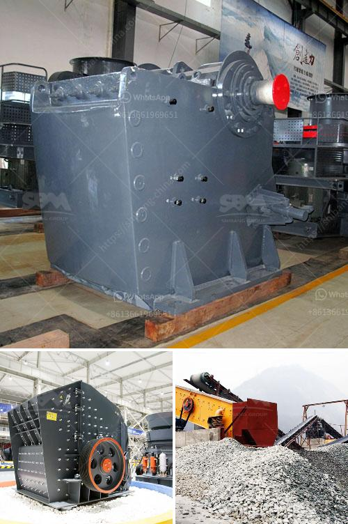

<h3>ball mills as size reduction equipment</h3>
Ball mills are a type of machine used for grinding and mixing various materials, such as minerals, ores, pyrotechnics, paints, and ceramics. They are widely used in the mining, power generation, cement industry, and other manufacturing sectors. Ball mills have become indispensable equipment in the size reduction process due to their versatility and cost-effectiveness.

The basic working principle of a ball mill is simple: the grinding medium (balls) and the material to be processed (raw material, ores, cement clinker, etc.) are placed in a rotating container filled with grinding media. As the container rotates, the suitable grinding medium is carried to a certain height and then falls onto the material, crushing and grinding it into fine particles.

One significant advantage of ball mills is the ability to achieve high production capacity with little effort and maintenance requirements. They operate reliably with a low energy consumption per ton of cement, and are easy to control the fineness of the product. As a result, ball mills are used for grinding materials ranging from clinker and gypsum to cement and slag.

With its compact design, easy installation, and low maintenance requirements, ball mills have emerged as the preferred solution for size reduction in the mining industry. However, their role in size reduction is not limited to these industries. They can also be used in the pharmaceutical, chemical, and food industries, as well as in the manufacturing of paints and pigments.

The main advantages of using ball mills as size reduction equipment are their simple design and compact size, ease of installation, reliable performance, and low maintenance requirements. They can be used for both wet and dry grinding, making them ideal for bulk and continuous materials processing.

Additionally, the use of ball mills for size reduction offers several other benefits. They allow for precise control of the particle size distribution, enabling better product quality and consistency. The grinding media in a ball mill can be customized to meet specific application requirements, allowing for optimal performance and efficiency.

In recent years, advancements in technology have led to the development of improved ball mills. For instance, high-energy ball mills can achieve ultrafine grinding, surpassing other grinding methods in terms of fineness and speed. Another example is the planetary ball mill, a highly efficient grinding mill that relies on planetary motion to achieve fine particle size reduction.

In conclusion, ball mills are an essential piece of equipment in the size reduction process. They are versatile, cost-effective, and can produce reliable results for a wide range of materials. Whether used in the mining industry or other manufacturing sectors, ball mills provide an effective solution for achieving the desired particle size distribution, leading to improved product quality.
<h3>Contact us</h3><ul><li><strong>Whatsapp:&nbsp;<a href="https://wa.me/8613661969651">+8613661969651</a></strong></li><li><a href="https://swt.shibang-china.com/?git&amp;zhl&amp;ball mills as size reduction equipment"><strong>Online Service(chat now)</strong></a></li></ul><h3>Related</h3><ul><li><a href='stone ball mill suppler kenya.md'>stone ball mill suppler kenya</a></li><li><a href='used stone crusher for sale in usa.md'>used stone crusher for sale in usa</a></li><li><a href='stone crusher plant best granite stone crushers.md'>stone crusher plant best granite stone crushers</a></li><li><a href='vertical roller mill manufacture in tamilnadu.md'>vertical roller mill manufacture in tamilnadu</a></li><li><a href='used sand screening equipment for sale.md'>used sand screening equipment for sale</a></li></ul>