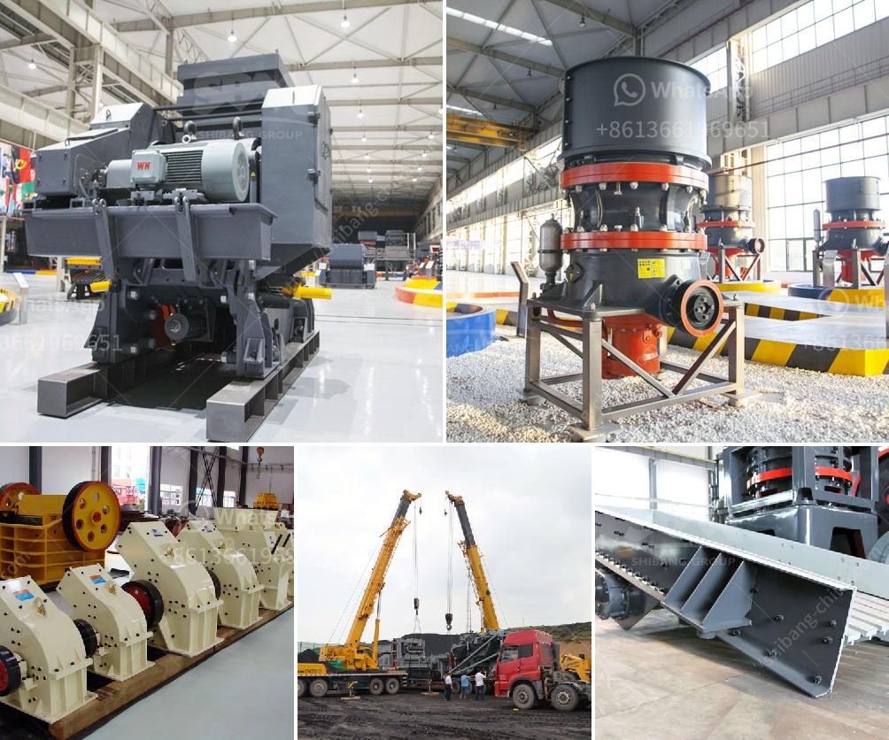

<h3>ball mills for mining technical drawing</h3>
Ball mills are a common grinding device in the mining industry, which are used to grind and blend materials into finer particles for further processing. Drawing upon years of experience and expertise in mineral processing, the Metso Outotec ball mill is designed with advanced engineering and manufacturing techniques for exceptional performance and durability.

The ball mill consists of a rotating cylindrical shell filled with grinding media, such as balls, usually made of steel or ceramic, that mix and crush the material as it passes through the mill. The lining of the shell is typically made of rubber, steel, or alloy steel. The continuous rotation of the shell ensures efficient grinding of the material.

A key feature of ball mills is their high energy efficiency, in which particles are broken by repeated impacts with the grinding media. This not only reduces the energy consumption but also increases the capacity of the mill. Additionally, the grinding media is vital for reducing the particle size, which affects the overall efficiency of downstream processes like flotation or leaching.

Technical drawings are an essential component of the ball mill design. They provide detailed information on the mill's dimensions, materials, and operating parameters. This includes the diameter and length of the mill, the rotational speed, the filling ratio, and the type and size of grinding media. Technical drawings help ensure that the mill is designed and engineered to meet the specific requirements of the mining operation.

In conclusion, ball mills are a fundamental part of the mining industry, as they are essential for grinding and blending materials for further processing. Metso Outotec's ball mill design utilizes advanced engineering techniques, resulting in high-quality and reliable equipment. Furthermore, technical drawings play a crucial role in the design and optimization of ball mills, ensuring their efficiency and effectiveness in the mining process.
<h3>Contact us</h3><ul><li><strong>Whatsapp:&nbsp;<a href="https://wa.me/8613661969651">+8613661969651</a></strong></li><li><a href="https://swt.shibang-china.com/?git&amp;zhl&amp;ball mills for mining technical drawing"><strong>Online Service(chat now)</strong></a></li></ul><h3>Related</h3><ul><li><a href='stone crusher plant in punjab.md'>stone crusher plant in punjab</a></li><li><a href='quartz crusher machine.md'>quartz crusher machine</a></li><li><a href='stone crusher second.md'>stone crusher second</a></li><li><a href='the cost of the stone crusher machine.md'>the cost of the stone crusher machine</a></li><li><a href='ore crusher for sale.md'>ore crusher for sale</a></li></ul>