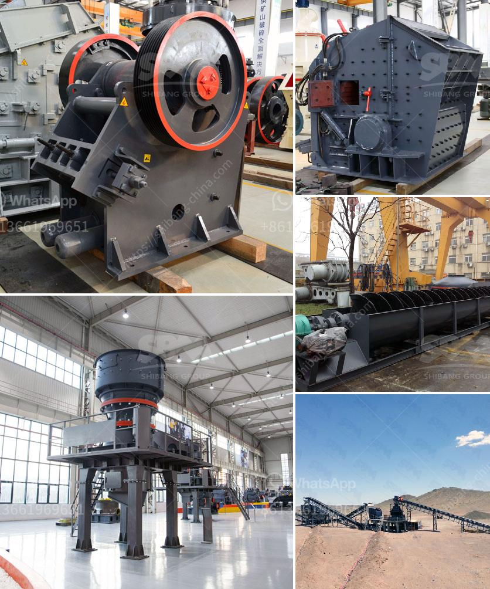

<h3>ball mills for rent</h3>
In the world of industrial machinery, finding the right equipment for specific tasks can often be a daunting challenge. When it comes to grinding and milling operations, ball mills have proven to be a highly versatile and efficient solution. If you're looking for a cost-effective grinding option or require temporary usage, renting a ball mill could be the answer. This article explores the benefits and applications of renting ball mills for your industrial needs.

A ball mill is a type of grinder used to grind, blend, and sometimes for mixing various materials together into a fine powder. It works on the principle of impact and attrition: size reduction is done by impact as the balls drop from near the top of the shell. The grinding media within the ball mill can be steel balls, ceramic balls, or even natural pebbles, ensuring uniform grinding and optimal performance.

1. Cost-effective solution: Renting a ball mill can significantly reduce upfront costs compared to purchasing new equipment. If you have a short-term project or require occasional grinding operations, renting allows you to access the required equipment without a substantial investment.

2. Flexibility: Renting grants you the flexibility to choose the appropriate ball mill based on your specific requirements. Different ball mill sizes and configurations are available, allowing you to achieve the desired fineness and capacity for your application without the burden of long-term ownership.

3. Maintenance and repairs: By renting a ball mill, you transfer the responsibility of maintenance and repairs to the rental company. This eliminates the need for in-house technicians and reduces downtime in case of equipment failure. Rental companies typically provide on-site support, ensuring uninterrupted operations and peace of mind.

4. Upgrading options: Renting a ball mill allows you to experiment with different models and features without committing to a lasting investment. This provides an opportunity to test the efficiency and suitability of various ball mills, enabling you to make informed and reliable purchasing decisions in the long run.

Ball mills find extensive applications in various industries, primarily for grinding purposes. Some key sectors that rely on ball mills include:

1. Mining and Mineral Processing: Ball mills are commonly used for grinding minerals, such as ore samples, to obtain finely ground material for further processing, separation, or concentration.

2. Construction and Cement Industry: In the production of building materials, such as cement, ball mills are utilized to grind clinker, gypsum, and other additives to achieve the desired consistency.

3. Chemical and Pharmaceutical Industry: Ball mills are employed for pulverizing chemicals, pharmaceuticals, and other materials into fine powders, facilitating processes such as particle size reduction, blending, and homogenization.

Renting ball mills offers a cost-effective and convenient solution for industrial grinding requirements. With the ability to access different models and sizes tailored to your specific application, renting provides ample flexibility and testing possibilities. From mining and construction to chemical processing, ball mills are an integral part of several industries, enabling efficient grinding for enhanced productivity and profitability. So next time you need a ball mill, consider renting one as a wise and practical choice.
<h3>Contact us</h3><ul><li><strong>Whatsapp:&nbsp;<a href="https://wa.me/8613661969651">+8613661969651</a></strong></li><li><a href="https://swt.shibang-china.com/?git&amp;zhl&amp;ball mills for rent"><strong>Online Service(chat now)</strong></a></li></ul><h3>Related</h3><ul><li><a href='stone crusher plant best granite stone crushers.md'>stone crusher plant best granite stone crushers</a></li><li><a href='mobile stone crusher suppliers.md'>mobile stone crusher suppliers</a></li><li><a href='chinese companies looking for partners in africa.md'>chinese companies looking for partners in africa</a></li><li><a href='ultra fine grinder feeding size.md'>ultra fine grinder feeding size</a></li><li><a href='pulverizer crusher machine for coal.md'>pulverizer crusher machine for coal</a></li></ul>