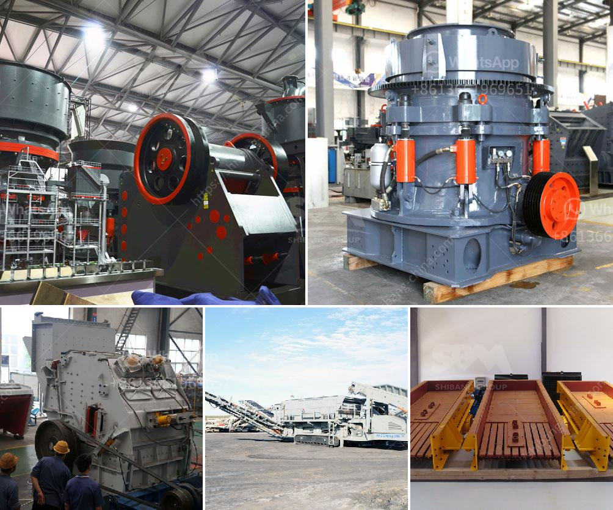

<h3>ball mills in monterrey</h3>
Ball mills were first introduced in Monterrey in the 19th century to grind materials into extremely fine powder for use in mineral processing plants. The ball mill is a cylindrical device that grinds material inside a rotating drum, attracting tremendous attention from mining investors.

The innovative design of ball mills revolutionized the mining industry, providing a simpler grinding process that achieves better efficiency and profitability. Monterrey, a city known for its rich mineral resources, quickly embraced this new technology, which has become a cornerstone of the local mining industry.

The process of grinding in a ball mill begins with the material being fed into the drum, which rotates at a certain speed. The grinding media (balls) inside the drum continuously collide with the material, creating a fine powder. The grinding of minerals is a crucial step in mineral processing, as it prepares the ore for further concentration and extraction of valuable minerals.

One key advantage of the ball mill is its versatility. It can grind a wide variety of materials, ranging from ores and minerals to cement, silicates, and other industrial products. The ability to finely grind different materials within a single machine streamlines the grinding process, saving time and costs. This flexibility makes ball mills an indispensable tool in the mining industry.

Efficiency is a critical factor in any mining operation, and ball mills excel in this area. The size reduction process achieved in a ball mill is more uniform compared to other grinding methods, such as crushing and pulverizing. This uniformity helps ensure a consistent grind, enhancing the efficiency of downstream processes like flotation and leaching.

Furthermore, the speed and rotational direction of the drum can be adjusted to optimize the grinding process for specific materials. By fine-tuning the operating parameters, ball mills in Monterrey can be tailored to achieve the desired fineness and throughput, maximizing the recovery of valuable minerals.

The introduction of ball mills in Monterrey has also contributed to increased sustainability in the mining industry. By reducing the need for energy-intensive crushing and pulverizing equipment, ball mills consume less energy while achieving the same or even better results. This translates into lower operating costs and reduced environmental impact.

In recent years, Monterrey has witnessed a surge in mining activities, with several new mining companies entering the region. The availability of advanced ball mill technology has attracted these investors, who recognize the potential for higher returns and improved operational efficiency. The growing demand for ball mills in Monterrey has also stimulated research and development, leading to continuous improvements in design and performance.

In conclusion, ball mills have undoubtedly transformed the mining industry in Monterrey. These machines offer an efficient and versatile grinding solution, capable of handling a wide range of materials with precision and consistency. As mining operations in Monterrey continue to expand, ball mills will continue to play a central role in mineral processing, revolutionizing the industry for years to come.
<h3>Contact us</h3><ul><li><strong>Whatsapp:&nbsp;<a href="https://wa.me/8613661969651">+8613661969651</a></strong></li><li><a href="https://swt.shibang-china.com/?git&amp;zhl&amp;ball mills in monterrey"><strong>Online Service(chat now)</strong></a></li></ul><h3>Related</h3><ul><li><a href='mini cement plant in west bengal.md'>mini cement plant in west bengal</a></li><li><a href='river sand garnet processing machines.md'>river sand garnet processing machines</a></li><li><a href='aggregate concrete plant.md'>aggregate concrete plant</a></li><li><a href='aggregate crushing contract in mexico.md'>aggregate crushing contract in mexico</a></li><li><a href='gypsum production plant suppliers in pakistan.md'>gypsum production plant suppliers in pakistan</a></li></ul>