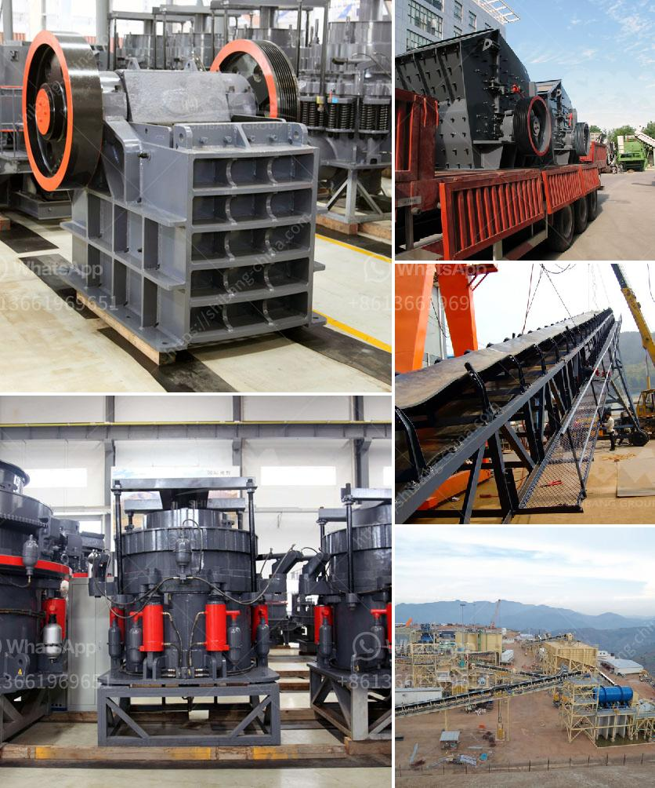

<h3>ball mills zenith china</h3>
Ball mills are a type of grinding mill, commonly used in chemical, metallurgical, and mining industries. With advancements in technology and industry demands, China’s machinery industry has rapidly grown, making ball mills Zenith China one of the most important sectors in the country.

Ball mills are cylindrical devices used to grind materials such as chemicals, ores, and ceramics into fine powders. They are widely utilized for various purposes in industries such as building materials, metalworking, and more. The advantage of using ball mills is their capability to produce high-quality powders with even particle size distribution.

Zenith China, a leading global manufacturer and supplier of crushing and grinding equipment, is renowned for providing a comprehensive range of ball mills to the market. In pursuit of excellence and innovation, Zenith China is constantly advancing their ball mill technology to meet industry demands.

One of the key features of Zenith China’s ball mills is their versatility. They offer various types and models of ball mills, including wet or dry grinding, overflow or grate discharge, modular designs, and more. This flexibility allows customers to choose the most suitable ball mill for their specific needs.

Furthermore, Zenith China’s advanced manufacturing capabilities ensure the superior quality and durability of their ball mills. They adopt high-quality materials, such as wear-resistant steel, to increase the lifespan of the equipment. Additionally, their stringent quality control measures and rigorous testing procedures guarantee reliable performance and efficiency.

As a reputable industry powerhouse, Zenith China has a strong commitment to sustainable development and environmental protection. Their ball mills are designed with energy-saving features, reducing energy consumption and environmental impact. By investing in Zenith China’s ball mills, customers can contribute to a greener and more sustainable future.

Moreover, Zenith China provides comprehensive after-sales services to ensure customer satisfaction. Their professional technical team offers installation guidance, operational training, and maintenance support. This ensures that customers can maximize the performance and lifespan of their ball mills, ultimately maximizing their return on investment.

Besides the production of high-quality ball mills, Zenith China is also known for their excellent customer service. They have established a global sales network to serve customers worldwide. Whether customers are located in North America, Europe, Asia, or any other region, Zenith China’s professional sales team is dedicated to providing timely and efficient assistance.

In conclusion, ball mills Zenith China is a promising sector in the country’s machinery industry. With their emphasis on research and development, advanced manufacturing capabilities, and commitment to sustainability, Zenith China has become a leading global provider of ball mills. Their versatile and durable equipment, coupled with comprehensive after-sales services, make them a reliable choice for customers worldwide.
<h3>Contact us</h3><ul><li><strong>Whatsapp:&nbsp;<a href="https://wa.me/8613661969651">+8613661969651</a></strong></li><li><a href="https://swt.shibang-china.com/?git&amp;zhl&amp;ball mills zenith china"><strong>Online Service(chat now)</strong></a></li></ul><h3>Related</h3><ul><li><a href='mineral grinding mill.md'>mineral grinding mill</a></li><li><a href='cement grinding machine.md'>cement grinding machine</a></li><li><a href='mobile jaw crusher price.md'>mobile jaw crusher price</a></li><li><a href='jaw crusher calculating.md'>jaw crusher calculating</a></li><li><a href='used ballast crusher in uk.md'>used ballast crusher in uk</a></li></ul>