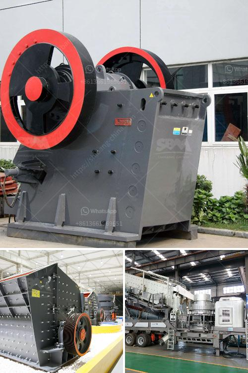

<h3>ballast crusher kenya</h3>
Many customers in Kenya are interested into the diesel engine ballast crushing machine, here I will introduce some hot small models for small mining and quarry plant.

Diesel engine stone ballast crusher machine is a type of diesel engine crusher. There is a simple type diesel engine stone ballast crushing machine, which is an only ballast crusher machine with a diesel engine. But now I introduce is a model which the crusher and diesel engine is on a structure and which can be designed into mobile type also.

Diesel engine stone ballast crushing machine is a good choice for Kenya customers, because it is easy to operate and maintain, stable performance, and convenient maintenance.

Diesel engine powered ballast crusher is also called portable diesel engine ballast crusher, which is powered by diesel engine and can be easily moved. Therefore, it is often used in some places with limited electricity or no electricity.

Diesel engine powered ballast crusher can be divided into two types: fixed type and portable type. The portable ballast crusher can be equipped with jaw crusher, impact crusher and cone crusher for different crushing stages according to different requirements.

The ballast crusher with good performance can be produced for different requirements of customers. All these models satisfy the customer's demands. We make customized plant according to customers' needs. The ballast crusher can be equipped flexibly, and the users can adjust the size of material according to their own needs.

What's more, the shape of final products is good. The ballast crusher is with high crushing ratio, good performance, low costs, high production efficiency, and large capacity. It can be used for primary and fine crushing.

With the development of technology and high industrialization, the crushing equipment ballast crusher is more and more important in the world. And the ballast crusher has the excellent power performance, to produce fewer fines for quarrying businesses. So the road construction project builds wider and wider.

We are the leading ballast crusher supplier in Kenya. We have over 30 years' experience in manufacturing and supplying ballast crushers. Our ballast crushers have been exported to South Africa, Saudi Arabia, Indonesia, Vietnam, Kenya and other countries.

We have professional team and provide quality after-sales service. For more information about ballast crusher machine price, please contact us!
<h3>Contact us</h3><ul><li><strong>Whatsapp:&nbsp;<a href="https://wa.me/8613661969651">+8613661969651</a></strong></li><li><a href="https://swt.shibang-china.com/?git&amp;zhl&amp;ballast crusher kenya"><strong>Online Service(chat now)</strong></a></li></ul><h3>Related</h3><ul><li><a href='caco3 carbonate calcium line production.md'>caco3 carbonate calcium line production</a></li><li><a href='gold wash plants built in the northwest.md'>gold wash plants built in the northwest</a></li><li><a href='quarry crusher for sale in ghana.md'>quarry crusher for sale in ghana</a></li><li><a href='steel slag cement manufacture process ppt.md'>steel slag cement manufacture process ppt</a></li><li><a href='cement plant setup cost in philippines.md'>cement plant setup cost in philippines</a></li></ul>