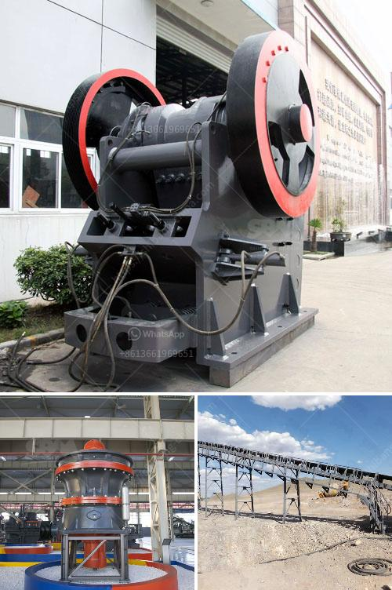

<h3>ballast crushing machine prices in kenya</h3>
Ballast is the foundation upon which railway tracks are laid. It is used to bear the load from the railroad ties, to facilitate drainage of water, and also to keep the tracks in place. Additionally, ballast helps to distribute the weight of trains evenly and ensures that the tracks remain stable.

Kenya, being a developing country, is grappling with various infrastructure projects that are on-going or are in the pipeline. With the increasing population and rapidly growing economy, there is a need to expand the country's railway network. As a result, there is a high demand for ballast that is used in the construction of rail tracks.

To meet this demand, suppliers and dealers of ballast are making a fortune by selling sand, crushed stones, and gravel used by these companies. The ballast crusher machine is vital equipment for ballast production. Therefore, it is essential to understand the factors affecting the price of ballast crushing machines in Kenya.

The demand for ballast is very high in Kenya due to the increasing population and development projects. Railways, roads, houses, bridges, and other construction projects in Kenya rely heavily on ballast to support the structures. Ballast crushing is therefore a necessary process before construction begins.

Different ballast crushers have different prices. Ballast crusher prices in Kenya are influenced by factors such as:

1. The quality of the product: The quality of the ballast crusher machine significantly determines the amount of money you will spend on it. High-quality machines guarantee durability, efficient operations, and low energy consumption.

2. The price of raw materials: The materials used in the production of ballast crushers are quite costly, as they need to be sourced from reliable suppliers. Costly materials imply that the machines are relatively expensive.

3. Mobility: Mobile ballast crushers are paramount in crushing and screening processes because they enable you to move around and reach inaccessible places where stationary machines cannot be easily deployed. As a result, mobile crushers offer higher flexibility and convenience, and their prices are accordingly higher.

4. Availability: Of course, the more popular a machine is, the more demand there is. The demand and supply dynamics have a direct impact on the prices of ballast crushing machines. With respect to the ballast crushing machine, the popular suppliers in the market are likely to raise prices, while small companies with less distribution power and bargaining power will tend to reduce the price of ballast crushers to create more room for competition.

Every machine comes with certain advantages and disadvantages. So, when you're making a purchase, it's important to take all factors into consideration and choose the machine that best suits your requirements and budget.

In conclusion, ballast crushing machines in Kenya are varied, while the price is diverse. In recent years, Kenya’s infrastructure construction has developed rapidly. Ballast stone is an important raw material for road and railway construction as well as concrete, so many customers are investing in ballast production line equipment. With high efficiency, low energy consumption, high production efficiency, and environmental protection, ballast crushing equipment is increasingly favored by customers.

Therefore, the price of ballast crushing machine will become more and more important. We have always been striving for excellence in the manufacture of mining equipment, and diligently committed to providing good products and high-quality services to our customers. As a reliable manufacturer of mining machinery, we have adopted advanced technology, integrated resources, and formed a strong team to ensure the comprehensive quality of our products. We are confident that we can offer competitive prices for ballast crushing machines in Kenya, and look forward to serving you.
<h3>Contact us</h3><ul><li><strong>Whatsapp:&nbsp;<a href="https://wa.me/8613661969651">+8613661969651</a></strong></li><li><a href="https://swt.shibang-china.com/?git&amp;zhl&amp;ballast crushing machine prices in kenya"><strong>Online Service(chat now)</strong></a></li></ul><h3>Related</h3><ul><li><a href='mill ore grind size passing 200 mesh.md'>mill ore grind size passing 200 mesh</a></li><li><a href='dust control for crushing plants.md'>dust control for crushing plants</a></li><li><a href='carbon black processing machine in delhi.md'>carbon black processing machine in delhi</a></li><li><a href='quartz crushing plant german tecnology.md'>quartz crushing plant german tecnology</a></li><li><a href='gold mining processing plant in canada.md'>gold mining processing plant in canada</a></li></ul>