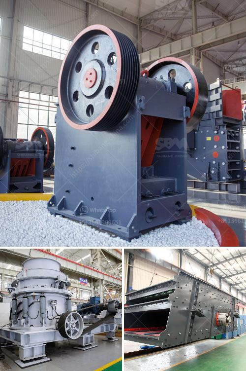

<h3>ballast crushing machinery</h3>
Railway tracks are one of the most critical infrastructure components in any nation's transportation system. They are crucial not only for passenger trains but also for freight transportation, connecting various cities and regions. To ensure the stability and proper functioning of railway tracks, ballast is essential.

Ballast is the foundation upon which the railway tracks are laid. It is typically made of crushed stones or rocks that are tightly packed together to provide a stable and sturdy base. The primary purpose of ballast is to distribute the load from the trains to the underlying layers and prevent the tracks from moving or deforming under stress.

To produce high-quality ballast, it is crucial to utilize ballast crushing machinery. Ballast crushers are specialized machines that are used to reduce the size of large rocks into smaller stones or gravel. These machines are typically used in the construction industry to produce railway ballast, road-fill materials, and concrete aggregates.

The crushing process involves multiple stages, including primary, secondary, and tertiary crushing, screening, and storage. Crushing machinery is designed to break down large rocks into smaller pieces that are suitable for further processing. This process enables the production of ballast with the desired characteristics, such as uniform size, angular shape, and high strength.

There are various types of ballast crushing machinery available in the market today. Each type offers distinct advantages and is suitable for different applications. Jaw crushers are commonly used for primary crushing and are capable of processing large rocks with a maximum size of 1800mm. Cone crushers, on the other hand, are more suitable for secondary and tertiary crushing stages and can produce finer and more uniform ballast.

Impact crushers are another popular choice for crushing ballast. They can process a wide range of materials and produce consistent and high-quality ballast. Additionally, impact crushers offer quick and easy maintenance, making them highly efficient in demanding environments such as railway construction sites.

In recent years, advancements in technology have led to the development of mobile ballast crushers. These portable machines can be easily transported to remote locations, allowing for on-site crushing and reducing the logistical challenges associated with transporting ballast aggregates from a quarry to the construction site.

Investing in high-quality ballast crushing machinery is essential for ensuring the longevity and stability of railway tracks. When the ballast is of inferior quality or poorly installed, it can result in frequent maintenance and repair work, leading to increased costs and disruptions in train schedules.

Properly crushed ballast not only provides a stable foundation for the tracks but also prevents the accumulation of water, which can cause soil erosion and track instability. Additionally, high-quality ballast helps to distribute the load evenly, minimizing the risk of track deformation and ensuring a smoother and safer train ride.

In conclusion, ballast crushing machinery plays a crucial role in the construction of railway tracks. It helps produce high-quality ballast that provides stability, strength, and longevity to the tracks. Selecting the right type of crushing machinery and investing in top-quality equipment is vital for the efficient and safe operation of railways.
<h3>Contact us</h3><ul><li><strong>Whatsapp:&nbsp;<a href="https://wa.me/8613661969651">+8613661969651</a></strong></li><li><a href="https://swt.shibang-china.com/?git&amp;zhl&amp;ballast crushing machinery"><strong>Online Service(chat now)</strong></a></li></ul><h3>Related</h3><ul><li><a href='thailand granite quarry crusher.md'>thailand granite quarry crusher</a></li><li><a href='romania ball mill manufacturer.md'>romania ball mill manufacturer</a></li><li><a href='iron ore crushing plant in germany.md'>iron ore crushing plant in germany</a></li><li><a href='used hammer mill.md'>used hammer mill</a></li><li><a href='screening machines specification.md'>screening machines specification</a></li></ul>