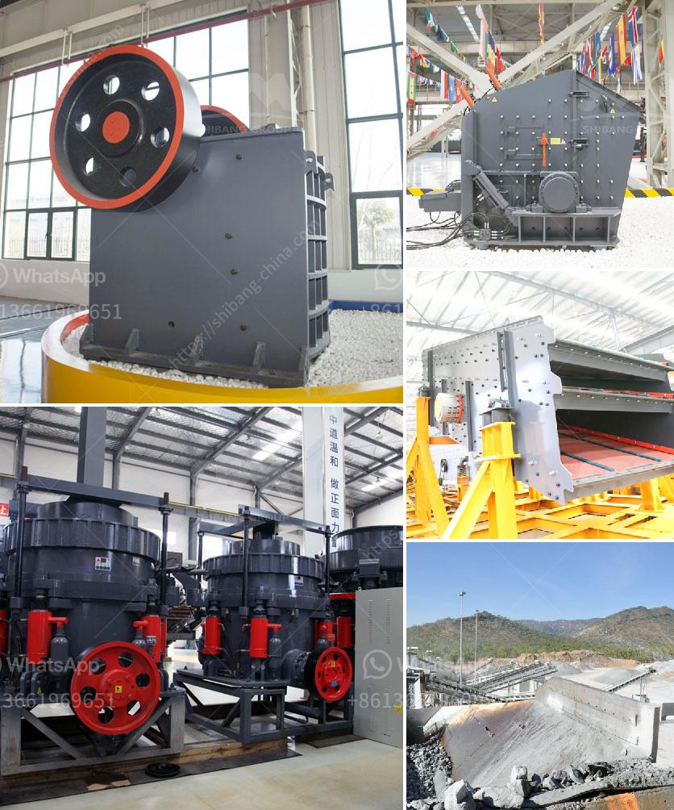

<h3>ballast crushing project</h3>
On a well-laid rail track, ballast forms the trackbed upon which sleepers or railroad ties are placed. It is packed between, below, and around the ties to provide stability, drainage, and support. However, over time, the ballast becomes worn and damaged, losing its structural integrity.

Crushed ballast, along with other granular materials, is commonly used in the construction of new tracks or the rehabilitation of existing ones. In recent years, the focus has shifted towards the importance of crushing and recycling ballast as part of sustainable development efforts and environmental initiatives.

One of the primary reasons for undertaking ballast crushing projects is to ensure the quality of the trackbed. When rail tracks are subjected to heavy loads and vibrations from passing trains, the ballast can become compressed or displaced. This compromises the track's stability and can lead to safety hazards, such as derailments or accidents. By crushing and recycling ballast, it is possible to restore its original gradation and angularity, providing a firm base for the railroad ties.

Another significant advantage of ballast crushing projects is the reduction in the environmental impact of disposal. Traditional ballast disposal methods often involve stockpiling old material or dumping it in landfills, causing pollution and taking up valuable land space. By processing the used ballast through crushing plants, it can be recycled and reused back in the railway infrastructure, reducing the need for new extraction and saving natural resources.

The process of ballast crushing involves several stages. Firstly, the ballast material is excavated from the trackbed and transported to the crushing plant. From there, the material is fed into the primary crusher, usually a jaw crusher, where it is reduced in size. The crushed ballast is then moved to a secondary crusher, often an impact crusher or a cone crusher, where it is further reduced in size.

After the crushing process, the ballast undergoes various screenings, sorting, and washing processes to remove any contaminants or impurities. The resulting clean and properly graded ballast can be reused efficiently back on the railway track, improving its overall performance and longevity.

Many countries and railway authorities are recognizing the importance of ballast crushing projects and are actively promoting their implementation. They understand the significant benefits in terms of track stability, reduction in environmental impact, and cost savings.

In conclusion, ballast crushing projects contribute to the sustainable development and maintenance of railway infrastructure. By recycling and reusing the crushed material, the quality and stability of the trackbed can be improved while reducing environmental pollution and promoting resource conservation. As railway networks continue to expand and modernize, incorporating ballast crushing projects into the construction and maintenance processes is crucial for a reliable and sustainable rail transportation system.
<h3>Contact us</h3><ul><li><strong>Whatsapp:&nbsp;<a href="https://wa.me/8613661969651">+8613661969651</a></strong></li><li><a href="https://swt.shibang-china.com/?git&amp;zhl&amp;ballast crushing project"><strong>Online Service(chat now)</strong></a></li></ul><h3>Related</h3><ul><li><a href='manufacturer of portable floatation plant in china.md'>manufacturer of portable floatation plant in china</a></li><li><a href='buy impact crushers.md'>buy impact crushers</a></li><li><a href='cone crusher factory south africa.md'>cone crusher factory south africa</a></li><li><a href='harga mesin sekunder stone crusher bekas.md'>harga mesin sekunder stone crusher bekas</a></li><li><a href='jaw crusher design.md'>jaw crusher design</a></li></ul>