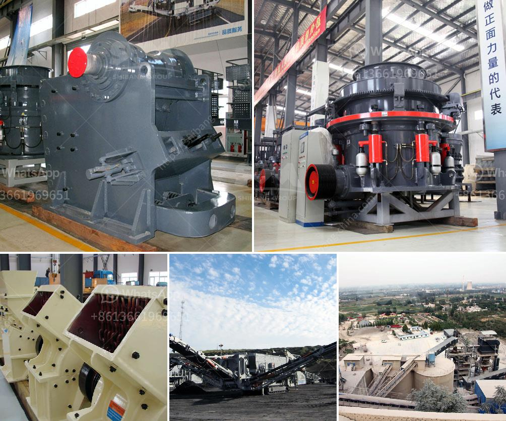

<h3>ballast processing plant</h3>
When it comes to constructing roads, railways, or even building foundations, ballast is an essential component that ensures the stability and durability of the infrastructure. Ballast processing plants play a crucial role in processing and producing high-quality ballast materials used in various construction projects. This article explores the significance of ballast processing plants and the processes involved in delivering top-notch ballast.

A ballast processing plant is a specialized facility where raw materials such as rocks, stones, and gravel are transformed into ballast. The primary purpose is to produce high-quality aggregates that meet the specific requirements of construction projects. These plants are equipped with cutting-edge machinery, crushers, screens, and conveyor belts that help break down the raw materials and separate them into different sizes.

The first step in the ballast processing plant involves the extraction of raw materials from quarries or mines. These materials are usually sourced from local sites to minimize transportation costs and ensure a constant supply. Once the raw materials are collected, they are transported to the processing plant for further refinement.

At the processing plant, the raw materials are first crushed using powerful crushers. The crushers break down the larger rocks and stones into smaller pieces suitable for further processing. In some cases, blasting and drilling techniques are employed to extract larger rocks from the quarries or mines.

Next, the crushed materials are sieved and separated into different sizes using vibrating screens. This process ensures that the ballast is uniform and of the required size. The separated materials are then conveyed to different storage or stockpiling areas based on their size and quality.

After the initial processing, the ballast undergoes a series of quality control procedures to ensure that it meets the construction standards and specifications. This includes testing for particle size distribution, strength, durability, and resistance to wear and tear. Quality assurance is crucial to guarantee the longevity and reliability of the final infrastructure.

Once the ballast passes the quality checks, it is ready for distribution to construction sites. The processed ballast is either loaded onto trucks or transported via rail to project locations. Special care is taken during transportation to prevent any contamination or degradation of the material.

In conclusion, ballast processing plants play an integral role in the construction industry by providing high-quality ballast materials needed for various infrastructure projects. Through a series of refining processes, including crushing, sieving, and quality control procedures, raw materials are transformed into durable and reliable ballast. These plants ensure that the ballast meets the required standards, such as particle size distribution and strength. By providing top-notch ballast, these plants contribute to the stability, safety, and longevity of roads, railways, and building foundations.
<h3>Contact us</h3><ul><li><strong>Whatsapp:&nbsp;<a href="https://wa.me/8613661969651">+8613661969651</a></strong></li><li><a href="https://swt.shibang-china.com/?git&amp;zhl&amp;ballast processing plant"><strong>Online Service(chat now)</strong></a></li></ul><h3>Related</h3><ul><li><a href='processing on barite crushing.md'>processing on barite crushing</a></li><li><a href='crusher dimensions crusher conica.md'>crusher dimensions crusher conica</a></li><li><a href='small jaw crusher.md'>small jaw crusher</a></li><li><a href='overflow type ball mill.md'>overflow type ball mill</a></li><li><a href='buy ball mill india.md'>buy ball mill india</a></li></ul>