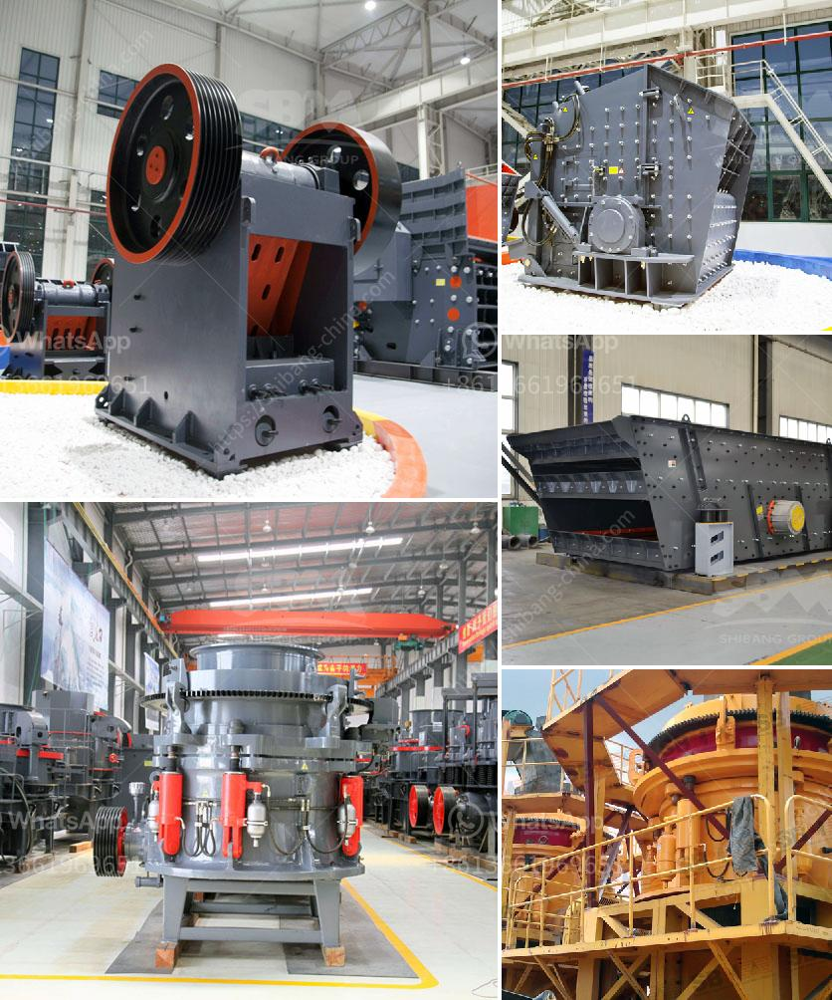

<h3>barite grinding equipment</h3>
Barite is a common mineral found in many parts of the world. It has a wide range of applications due to its versatile properties. One of the significant uses of barite is in the oil and gas industry as a weighting agent in drilling fluids. It helps control the pressure exerted by the drilling fluid and prevents blowouts during the drilling process.

To meet the increasing demand for barite, efficient grinding equipment is essential. Barite grinding equipment, also known as barite grinding mill, can grind various minerals into different particle sizes. This equipment is widely used in the fields of metallurgy, mining, chemical industry, cement, construction, refractory materials, ceramics, and so on.

The main purpose of barite grinding equipment is to grind barite particles into a uniform particle size. In this process, the barite raw materials are evenly fed into the grinding chamber by the vibrating feeder. After being grinded by the grinding roller, the barite particles are classified by the classifier and then passed through the analysis machine and the wind machine for particle size analysis and separation. The powder that meets the fineness requirements enters the cyclone powder collector with the airflow, and is discharged through the discharge valve as the finished product.

Barite grinding equipment has many advantages. Firstly, it has high efficiency and energy-saving. Under the same grinding conditions, the output is higher than that of traditional grinding equipment. Secondly, it has stable performance and reliable operation. The roller and grinding ring are made of special materials, which prolongs the service life of the equipment. Thirdly, the fineness of the finished product is adjustable. The fineness can be controlled by adjusting the speed of the classifier wheel. Fourthly, the sealing effect is good, and the dust pollution is minimal. It meets the environmental protection requirements.

In conclusion, barite grinding equipment plays a crucial role in the barite processing industry. It ensures the high-quality production of barite powder and promotes the development of the barite industry. With the continuous innovation and improvement of technology, barite grinding equipment will become more efficient and advanced, meeting the needs of various industries.
<h3>Contact us</h3><ul><li><strong>Whatsapp:&nbsp;<a href="https://wa.me/8613661969651">+8613661969651</a></strong></li><li><a href="https://swt.shibang-china.com/?git&amp;zhl&amp;barite grinding equipment"><strong>Online Service(chat now)</strong></a></li></ul><h3>Related</h3><ul><li><a href='artificial marble manufacturing machineprocess india.md'>artificial marble manufacturing machineprocess india</a></li><li><a href='second hand mobile crusher plant.md'>second hand mobile crusher plant</a></li><li><a href='list iron ore pellet plants in india.md'>list iron ore pellet plants in india</a></li><li><a href='iron ore processing plant design pdf.md'>iron ore processing plant design pdf</a></li><li><a href='crusher plant in sri lanka.md'>crusher plant in sri lanka</a></li></ul>