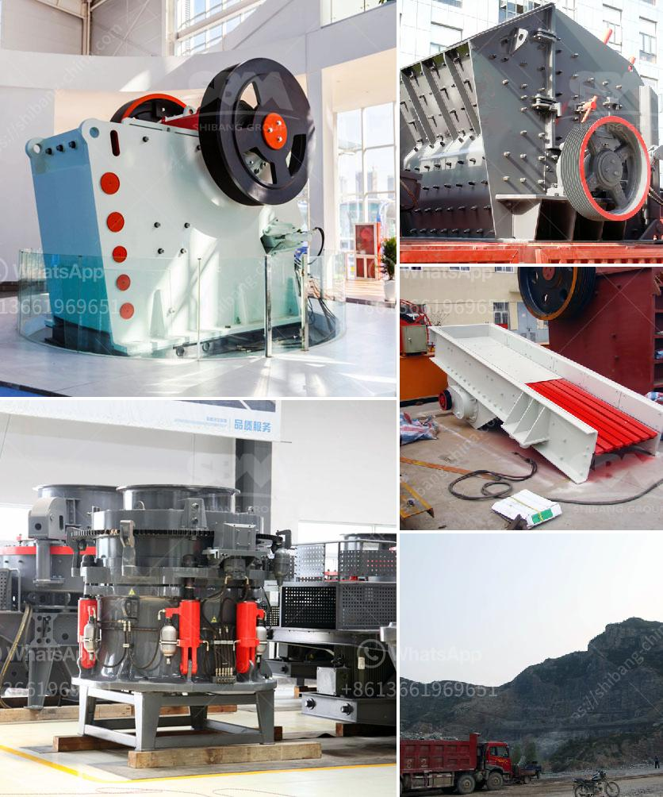

<h3>barite mill crusher</h3>
Barite, also known as baryte, is a mineral composed of barium sulfate (BaSO4). It is usually colorless or milky white, but can also be found in various shades of blue, yellow, or red. Barite is often used in the oil and gas industry as a weighing agent in drilling fluids, and it is also used in the production of barium compounds, chemicals, and pigments. To process barite ore efficiently and maximize its economic value, a barite mill crusher is the ultimate solution.

A barite mill crusher is a machine designed to reduce the size of barite raw ore into smaller particles. The crusher can achieve crushing efficiency through a combination of compression, shear, and impact forces. The crushing process includes both coarse and fine crushing stages, and various types of crushers can be used depending on the desired final product size.

One of the most commonly used crushers for barite ore processing is the jaw crusher. It is designed with a fixed and movable jaw plate to exert pressure on the raw material and crush it against the fixed jaw plate. This type of crusher has a high crushing ratio and large capacity, making it ideal for primary crushing.

After the initial crushing stage, the barite ore is further ground using a barite mill. A common type of barite mill is a ball mill, which utilizes steel balls as the grinding media. The ball mill grinds the ore by rotating a cylinder filled with steel balls, causing the balls to fall back into the cylinder and onto the material to be ground. This grinding process reduces the barite ore to a fine powder, which can then be used in various industrial applications.

In addition to jaw crushers and ball mills, there are other types of crushers and mills that can be used for barite ore processing, such as impact crushers, cone crushers, and Raymond mills. These machines can be used for secondary and tertiary crushing, as well as fine grinding, depending on the specific requirements of the ore processing plant.

The barite mill crusher plays a crucial role in the entire barite ore processing plant. It not only reduces the size of the raw ore for further processing but also ensures the quality and consistency of the final product. The efficiency and performance of the crusher directly affect the overall production efficiency of the plant.

In conclusion, a barite mill crusher is an essential machine for the efficient processing of barite ore. It reduces the size of the raw material, prepares it for further processing, and ensures the quality of the final product. With its versatility and various types available, it can be tailored to meet the specific needs of different ore processing plants. Whether it is used in the oil and gas industry or other industrial applications, a barite mill crusher is the ultimate solution for maximizing the economic value of barite ore.
<h3>Contact us</h3><ul><li><strong>Whatsapp:&nbsp;<a href="https://wa.me/8613661969651">+8613661969651</a></strong></li><li><a href="https://swt.shibang-china.com/?git&amp;zhl&amp;barite mill crusher"><strong>Online Service(chat now)</strong></a></li></ul><h3>Related</h3><ul><li><a href='hammer mill for 200 mesh powder.md'>hammer mill for 200 mesh powder</a></li><li><a href='process of river rock crushing to make cement.md'>process of river rock crushing to make cement</a></li><li><a href='stone crush plant 4tph.md'>stone crush plant 4tph</a></li><li><a href='difference between ball mill and roller mill.md'>difference between ball mill and roller mill</a></li><li><a href='how to make marble powder statues.md'>how to make marble powder statues</a></li></ul>