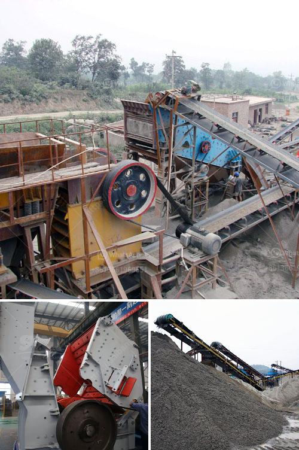

<h3>barite powder manufacturing machinery</h3>
Barite powder is a crucial raw material in many industries. However, the process of manufacturing barite powder is not as simple as it may seem. A range of specialized machinery and equipment is required to produce the desired quality and consistency of barite powder.

Barite, also known as baryte, is a naturally occurring mineral that is found in various shapes and colors. It is commonly used in the oil and gas drilling industry as a weighting agent to increase the density of drilling fluids. This helps to control the formation pressure, prevent blowouts, and lubricate the drilling bit.

To manufacture high-quality barite powder, several steps need to be followed. The first step is the extraction of barite ore from the ground. This is typically done through open-pit mining or underground mining, depending on the location and accessibility of the deposit.

Once the ore is extracted, it is then crushed and ground into a fine powder. This process requires heavy-duty machinery such as jaw crushers, impact crushers, and ball mills. These machines break down the large chunks of ore into smaller particles. Grinding is a critical step as it ensures the proper particle size distribution of the barite powder.

After grinding, the barite powder is then classified based on its size. This is achieved using screening equipment that separates the powder into different particle size ranges. The classified powder is then stored in silos or containers for further processing.

The next step is purification, where impurities are removed from the barite powder. This is typically done through the process of flotation or magnetic separation. Inflatable flotation machines are commonly used for barite flotation, while magnetic separators are employed to remove magnetic impurities. These machines utilize the differences in physical and chemical properties of the barite and impurities to separate them effectively.

Once the purification process is complete, the barite powder is dried to remove any remaining moisture. This is crucial to ensure the stability of the powder during transportation and storage. Various drying machinery, such as rotary dryers or flash dryers, are employed to achieve the desired dryness of the powder.

Finally, the barite powder is packed into bags or bulk containers for shipment to customers. Automatic packaging machines are used for efficient and accurate packaging of the powder. These machines can handle large volumes of barite powder and ensure consistent packaging quality.

In conclusion, the manufacturing process of barite powder involves a series of specialized machinery and equipment. From ore extraction to grinding, classification, purification, drying, and packaging, each step requires specific machinery to produce high-quality barite powder. The selection and operation of these machines are crucial to ensure the desired particle size, purity, and consistency of the final product. Properly manufactured barite powder is essential for its applications in the oil and gas industry, as well as in other industries such as chemicals, paints, rubber, and plastics.
<h3>Contact us</h3><ul><li><strong>Whatsapp:&nbsp;<a href="https://wa.me/8613661969651">+8613661969651</a></strong></li><li><a href="https://swt.shibang-china.com/?git&amp;zhl&amp;barite powder manufacturing machinery"><strong>Online Service(chat now)</strong></a></li></ul><h3>Related</h3><ul><li><a href='used hammer mill in india.md'>used hammer mill in india</a></li><li><a href='crushers for sale in south africa.md'>crushers for sale in south africa</a></li><li><a href='cost of stone crusher.md'>cost of stone crusher</a></li><li><a href='rolling mill process flow chart.md'>rolling mill process flow chart</a></li><li><a href='talc processing plant.md'>talc processing plant</a></li></ul>