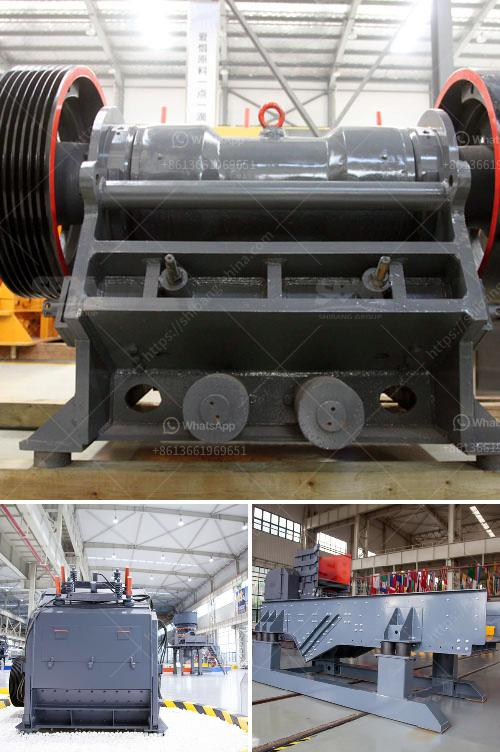

<h3>barytes processing equipment</h3>
Barytes, also known as barite, is a mineral that is widely used in various industries such as oil and gas, mining, and construction. It is primarily composed of barium sulfate and is known for its high specific gravity and chemical inertness.

To obtain high-quality barytes for commercial use, the mineral goes through a specific processing procedure. Barytes processing equipment plays a crucial role in this process, ensuring that the final product meets all the desired specifications and quality standards.

One of the key pieces of equipment used in barytes processing is the crusher. This machine is responsible for reducing the size of large barytes rocks into smaller particles. Crushing is essential to increase the surface area of barytes, allowing for more efficient processing and extraction of valuable minerals.

Once crushed, the barytes undergo a process called jigging, which is facilitated by specialized jigging machines. Jigging involves separating the mineral from impurities by utilizing the differences in their specific gravity. The barytes sink to the bottom of the water-filled jigging chamber, while less dense impurities are washed away. This process ensures that the extracted barytes are of high purity and quality.

After jigging, the barytes are dried and classified through a screening process. In this stage, vibrating screens are used to separate the barytes into different size fractions. By classifying the mineral, it becomes easier to meet the specific requirements of end-users, whether it is in drilling muds, paints, or other applications.

To enhance the final product's properties, barytes may undergo additional processes such as magnetic separation or gravity concentration. These processes further refine the barytes, ensuring it meets the necessary specifications for its intended application.

In conclusion, barytes processing equipment is essential for obtaining high-quality barytes suitable for various industries. Crushers, jigging machines, vibrating screens, and other specialized equipment play a significant role in the processing and refinement of barytes. By employing these equipment, mining companies can produce barytes with high purity, consistent quality, and optimal particle size distribution to meet the diverse needs of their customers.
<h3>Contact us</h3><ul><li><strong>Whatsapp:&nbsp;<a href="https://wa.me/8613661969651">+8613661969651</a></strong></li><li><a href="https://swt.shibang-china.com/?git&amp;zhl&amp;barytes processing equipment"><strong>Online Service(chat now)</strong></a></li></ul><h3>Related</h3><ul><li><a href='dry grinding rod mill.md'>dry grinding rod mill</a></li><li><a href='find a portable hand operated rock crusher.md'>find a portable hand operated rock crusher</a></li><li><a href='used stone crusher for sale in italy.md'>used stone crusher for sale in italy</a></li><li><a href='double rotor impact hammer crusher.md'>double rotor impact hammer crusher</a></li><li><a href='screening machines specification.md'>screening machines specification</a></li></ul>