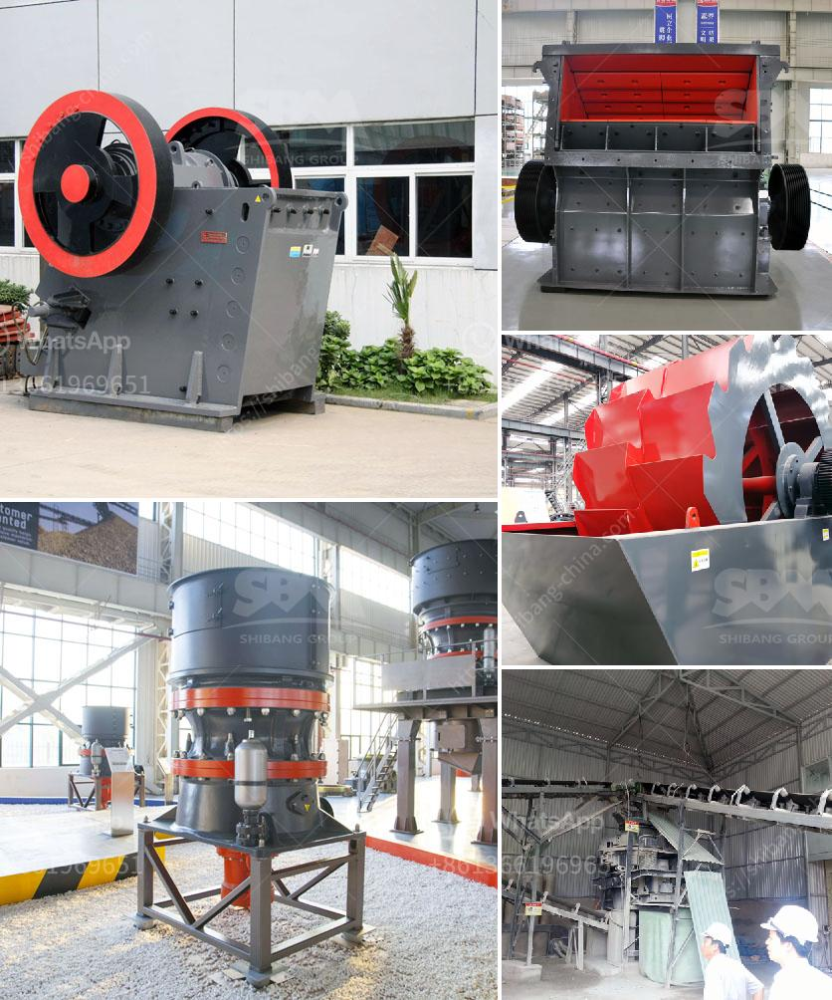

<h3>basalt processing machine</h3>
Basalt, a common volcanic rock, is formed by the rapid cooling of lava exposed to the surface of the earth. Basalt is popular for its durability, making it a suitable material for construction projects, such as building bridges, roads, and even statues. To utilize this rock efficiently, the basalt processing machine is essential. This article will explore the different aspects of basalt processing machines and their importance in the construction industry.

Basalt processing machines come in various forms, depending on the requirements of the project. The primary machine used in basalt processing is the basalt crushing machine. It is used to crush basalt rocks into smaller particles for further processing. With high efficiency and uniform particle size, the basalt crushing machine is suitable for processing both soft and hard materials.

After the basalt rocks are crushed, the next step is to separate the particles based on their size. This is done using a basalt screening machine. The screening machine is equipped with different sized screens to separate the crushed particles into various sizes, allowing for different applications in the construction industry. This process helps ensure that the desired particle size is obtained for specific projects.

Once the basalt particles are sorted, they can be used for various construction applications. The basalt processing machine also includes a basalt grinding mill, which grinds the crushed basalt particles into a fine powder. This powder can be used as a filler in asphalt and concrete mixtures, as well as in soil stabilization and reinforcement projects. The fine powder obtained from basalt processing helps enhance the overall strength and durability of construction materials.

Aside from the crushing, screening, and grinding processes, basalt processing machines also include other equipment such as conveyors, feeders, and storage systems. These machines ensure a seamless flow of material throughout the processing plant, allowing for efficient and continuous production. Proper handling and transportation of the processed basalt materials are crucial to maintain the quality and integrity of the final product.

In conclusion, basalt processing machines play a vital role in the construction industry. These machines facilitate the crushing, screening, and grinding processes required to obtain the desired particle size of basalt rocks. The processed basalt materials can be used for various construction applications, enhancing the strength and durability of construction projects. Basalt processing machines not only contribute to the efficiency of the construction industry but also help reduce waste by recycling and repurposing basalt rocks. As the demand for sustainable construction materials continues to grow, basalt processing machines will remain a valuable asset.
<h3>Contact us</h3><ul><li><strong>Whatsapp:&nbsp;<a href="https://wa.me/8613661969651">+8613661969651</a></strong></li><li><a href="https://swt.shibang-china.com/?git&amp;zhl&amp;basalt processing machine"><strong>Online Service(chat now)</strong></a></li></ul><h3>Related</h3><ul><li><a href='china ball mill manufacturer.md'>china ball mill manufacturer</a></li><li><a href='materials used to make a talcum powder.md'>materials used to make a talcum powder</a></li><li><a href='mtm trapezium grinder mill.md'>mtm trapezium grinder mill</a></li><li><a href='dust control for crushing plants.md'>dust control for crushing plants</a></li><li><a href='crusher machine price list.md'>crusher machine price list</a></li></ul>