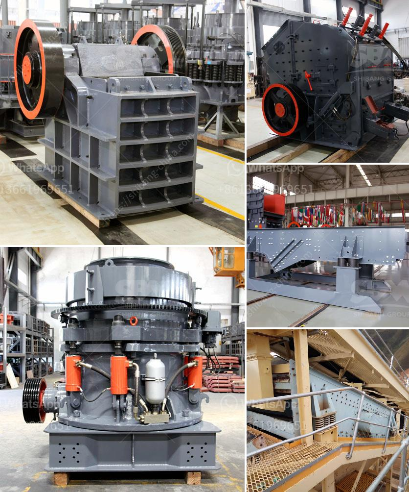

<h3>basalt rock crusher suppliers in dubai</h3>
Basalt rock is a type of igneous rock formed by the cooling of lava ejected from a volcano. It is a popular choice for construction materials due to its durability and abundance. Basalt crushers can effectively break down hard and abrasive materials, making them a popular choice for both the mining and construction industries.

Dubai, being a rapidly developing city in the United Arab Emirates (UAE), has seen a steady growth in its infrastructure and construction industry. With the rising demand for high-quality aggregates and asphalt for building projects, basalt rock has become a key component in the construction industry in Dubai.

To meet the demand for basalt rock, various crusher suppliers have emerged in Dubai. However, it is important to choose a reliable and reputable supplier for your construction needs. Here are some key factors to consider when selecting a basalt rock crusher supplier in Dubai:

1. Quality of the Equipment: It is essential to choose a supplier that offers high-quality crushers, screens, and other equipment. The equipment should be able to handle the tough demands of crushing basalt rock without experiencing frequent breakdowns or requiring constant maintenance.

2. Range of Products: A reputable supplier should offer a wide range of crushers and related equipment to suit different project requirements. This includes primary crushers for initial crushing, secondary crushers for further size reduction, and screens for separating the crushed materials.

3. Expertise and Experience: Look for a supplier that has extensive experience in the industry and a strong track record of delivering successful projects. They should have a deep understanding of basalt rock crushing and be able to provide expert advice and support.

4. After-Sales Service: A reliable supplier should prioritize customer satisfaction by offering excellent after-sales service. This includes timely maintenance and repairs, spare parts availability, and technical support.

5. Environmental Considerations: Sustainable practices are increasingly important in the construction industry. Choose a supplier that is committed to minimizing their environmental impact. This includes properly managing waste, reducing emissions, and promoting recycling.

By considering these factors, you can select a basalt rock crusher supplier in Dubai that provides high-quality products, reliable service, and contributes to sustainable construction practices.

In conclusion, basalt rock crushers are crucial for the construction industry in Dubai. With the growing demand for high-quality aggregates and asphalt, it is important to choose a reliable supplier that can provide durable equipment, a wide range of products, and excellent after-sales service. By investing in a reputable supplier, you can ensure the success of your construction projects in Dubai.
<h3>Contact us</h3><ul><li><strong>Whatsapp:&nbsp;<a href="https://wa.me/8613661969651">+8613661969651</a></strong></li><li><a href="https://swt.shibang-china.com/?git&amp;zhl&amp;basalt rock crusher suppliers in dubai"><strong>Online Service(chat now)</strong></a></li></ul><h3>Related</h3><ul><li><a href='cement machinery manufacturers in europe.md'>cement machinery manufacturers in europe</a></li><li><a href='puzzolana 200 tph cone crusher plant price.md'>puzzolana 200 tph cone crusher plant price</a></li><li><a href='vibration screen machine in pakistan.md'>vibration screen machine in pakistan</a></li><li><a href='egypt gold prospecting equipment manufacturers.md'>egypt gold prospecting equipment manufacturers</a></li><li><a href='ton crushing machine.md'>ton crushing machine</a></li></ul>