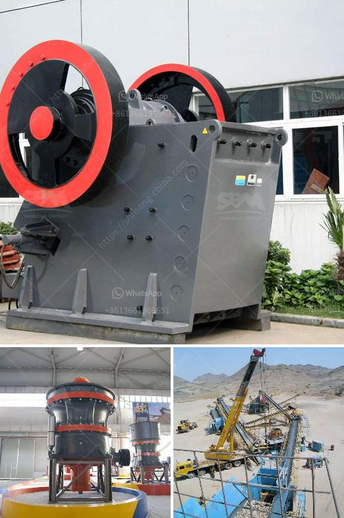

<h3>bauxite processing crusher</h3>
Bauxite is a mineral that is largely utilized in the making of aluminum. It is commonly found in tropical and subtropical regions, such as Africa, the Caribbean, South America, and Australia. To extract pure aluminum from bauxite, an extraction process known as the Bayer process is used.

One crucial step in this process is the crushing of bauxite, which is done through the use of heavy-duty crushers. These crushers are designed to break down the bauxite ore into smaller pieces that can be easily transported and processed. Crushing is done by mechanical means, such as jaw crushers or cone crushers, and results in a fine gravel-like material known as bauxite aggregate.

The primary crusher in this process is typically a gyratory or jaw crusher, which is capable of handling rocks up to several meters in size. Cone crushers are also used to further reduce the size of the material and produce a more uniform end product. Both crushers use compression force to break the bauxite ore, ensuring that it is finely crushed and can be easily processed further.

Once the bauxite ore has been crushed, it is then transported to a bauxite processing plant. Here, the crushed ore is mixed with a hot caustic soda solution, which dissolves the aluminum-bearing minerals in the bauxite to form a sodium aluminate solution. This solution is then filtered to separate the solid residue, known as red mud, from the liquid aluminate solution.

The liquid aluminate solution is further processed through a series of chemical reactions and treatments to eventually yield pure aluminum oxide, also known as alumina. This alumina is then smelted in a separate process to produce aluminum metal.

In conclusion, crushers play a vital role in the bauxite processing process, as they help break down the bauxite ore into more manageable sizes. This allows for easier transportation and processing of the material in bauxite processing plants. The extracted alumina can then be used to produce aluminum metal, which has a wide range of applications in various industries.
<h3>Contact us</h3><ul><li><strong>Whatsapp:&nbsp;<a href="https://wa.me/8613661969651">+8613661969651</a></strong></li><li><a href="https://swt.shibang-china.com/?git&amp;zhl&amp;bauxite processing crusher"><strong>Online Service(chat now)</strong></a></li></ul><h3>Related</h3><ul><li><a href='jaw crusher calculating.md'>jaw crusher calculating</a></li><li><a href='ethiopia widely used rock breaking.md'>ethiopia widely used rock breaking</a></li><li><a href='calcite micron powder grinding machine in thailand.md'>calcite micron powder grinding machine in thailand</a></li><li><a href='mill price of hammer mill.md'>mill price of hammer mill</a></li><li><a href='for a new stone quarry crusher in uganda.md'>for a new stone quarry crusher in uganda</a></li></ul>