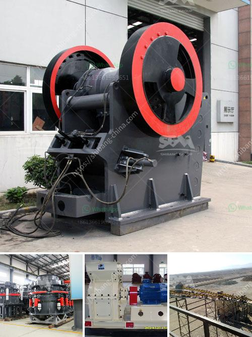

<h3>beast crusher price</h3>
In the modern world, construction and mining industries thrive on the efficiency and effectiveness of their equipment. One such equipment that has garnered significant attention in recent times is the Beast Crusher. This high-performance machinery has become a game-changer for many industry players due to its exceptional features and affordable price range.

The Beast Crusher is a revolutionary stone-crushing machine that is taking the market by storm. Known for its ability to deliver unmatched performance and durability, it has quickly become the preferred choice for construction and mining companies around the globe. The machine's robust design and innovative technology make it stand out from the competition.

One of the most remarkable aspects of the Beast Crusher is its affordability. Despite its groundbreaking features, this heavy-duty equipment comes at a competitive price, making it accessible to a wider range of businesses, from large corporations to individual contractors. This affordability factor has contributed significantly to its popularity and widespread adoption in the industry.

When compared to other stone-crushing machines in the market, the Beast Crusher offers excellent value for money. Its efficiency and capability to handle heavy-duty tasks make it an attractive investment for companies seeking to maximize their productivity while minimizing operational costs. The affordability of the machine results in a faster return on investment, which is a key consideration for any business.

Furthermore, the Beast Crusher's price is not a reflection of any compromise made on quality. Built with premium-grade materials and incorporating cutting-edge technology, this machine stands the test of time. Its robust construction ensures it can withstand even the harshest working conditions, including extreme temperatures, heavy loads, and prolonged use. By investing in the Beast Crusher, construction and mining companies can expect a reliable and long-lasting addition to their fleet of machinery.

Another factor that contributes to the popularity of the Beast Crusher is its versatility. This machine is designed to crush a wide range of materials, including rocks, concrete, and asphalt, making it suitable for various applications. Whether it's road construction, building foundations, or mining operations, the Beast Crusher delivers optimal performance in every scenario. Its adaptability to different job sites makes it a cost-effective choice for businesses that need flexibility in their operations.

In conclusion, the Beast Crusher has revolutionized the stone-crushing industry with its exceptional features, durability, and affordable pricing. Its ability to handle heavy-duty tasks and deliver unmatched performance makes it a game-changer for construction and mining companies worldwide. The affordability factor has given it a competitive edge over its counterparts, enabling businesses to optimize their productivity while keeping operational costs in check. As this machine continues to rule the market, it has become a go-to choice for those seeking unparalleled value for money.
<h3>Contact us</h3><ul><li><strong>Whatsapp:&nbsp;<a href="https://wa.me/8613661969651">+8613661969651</a></strong></li><li><a href="https://swt.shibang-china.com/?git&amp;zhl&amp;beast crusher price"><strong>Online Service(chat now)</strong></a></li></ul><h3>Related</h3><ul><li><a href='used crushers for sale in usa.md'>used crushers for sale in usa</a></li><li><a href='coal mill company in srilanka.md'>coal mill company in srilanka</a></li><li><a href='big slage crusher mechins plant.md'>big slage crusher mechins plant</a></li><li><a href='price of a large mobile crusher.md'>price of a large mobile crusher</a></li><li><a href='allis chalmers 54 x 74 gyratory crusher.md'>allis chalmers 54 x 74 gyratory crusher</a></li></ul>