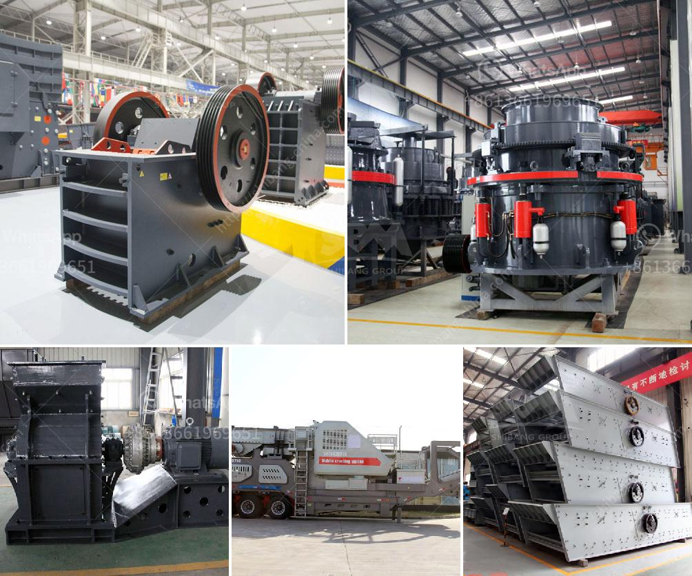

<h3>belt conveyor 12mm</h3>
A belt conveyor is a ubiquitous piece of machinery commonly used in various industries for the transportation of goods and materials. These innovative systems revolutionized the way products are moved, providing a safe and efficient method of conveying items from one location to another.

One particular type of belt conveyor that has gained popularity in recent years is the 12mm belt conveyor. With a width of merely 12 millimeters, this conveyor offers unique advantages and applications in different industrial settings. Despite its slender design, it boasts impressive capabilities that make it a versatile and essential component in material handling processes.

One of the primary advantages of a 12mm belt conveyor is its ability to handle small and delicate items effectively. Traditional conveyors often struggle to transport fragile or small-sized goods without causing damage or product loss. However, the narrow width of the 12mm belt makes it ideal for handling goods that require gentle handling, such as electronic components, small parts, or delicate food products. The conveyor's narrow profile reduces the risk of the items getting trapped or damaged during the transportation process, ensuring their integrity from start to finish.

Furthermore, the compact size of the 12mm belt conveyor enables its use in tight spaces and areas with limited clearance. In many industries, space optimization is crucial due to constraints in production facilities. With its narrow width, this conveyor offers excellent maneuverability, allowing it to fit into tight corners or work efficiently in areas where space is limited. This flexibility enhances overall operational efficiency and maximizes the utility of available floor space.

The 12mm belt conveyor also boasts exceptional durability and reliability. Despite its slender construction, it is engineered to withstand heavy loads and provide optimal performance over extended periods. The materials used in its fabrication, such as reinforced rubber or synthetic compounds, ensure its resilience and endurance under various working conditions. This durability translates into reduced maintenance costs and increased productivity, making it an attractive investment for businesses.

Moreover, the 12mm belt conveyor is easy to clean and maintain, contributing to improved hygiene and safety standards. In industries where cleanliness is of utmost importance, such as food production or healthcare, this characteristic is critical. Its narrow width allows for easy access during routine cleaning and maintenance, ensuring a thorough sanitization process. By reducing the risk of contamination and upholding high hygiene standards, businesses can enhance their reputation and comply with stringent regulatory requirements.

In conclusion, the 12mm belt conveyor is a reliable and versatile solution for handling small and delicate items in industries where space optimization and hygiene are vital. Its narrow width enables gentle transportation, efficient maneuverability, and reduced maintenance costs. By investing in this advanced material handling equipment, businesses can enhance their productivity, minimize product damage, and improve workplace safety. Whether it is for transporting electronic components, delicate food products, or other sensitive items, the 12mm belt conveyor has become an indispensable asset for many industries looking to enhance their logistical operations.
<h3>Contact us</h3><ul><li><strong>Whatsapp:&nbsp;<a href="https://wa.me/8613661969651">+8613661969651</a></strong></li><li><a href="https://swt.shibang-china.com/?git&amp;zhl&amp;belt conveyor 12mm"><strong>Online Service(chat now)</strong></a></li></ul><h3>Related</h3><ul><li><a href='quarry plant all in one gold mining equipment.md'>quarry plant all in one gold mining equipment</a></li><li><a href='vibrating screen for fine sand.md'>vibrating screen for fine sand</a></li><li><a href='clay aggregate machinery product.md'>clay aggregate machinery product</a></li><li><a href='raymond mill supplier.md'>raymond mill supplier</a></li><li><a href='gravel screening equipment.md'>gravel screening equipment</a></li></ul>