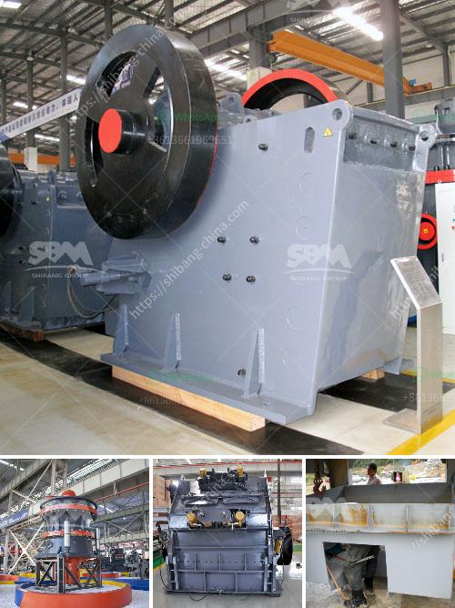

<h3>belt conveyor design</h3>
Belt conveyors are used across various industries for the efficient transportation of bulk materials, goods, and unit loads. Their design plays a crucial role in ensuring the smooth and uninterrupted movement of these items. A well-designed belt conveyor reduces manual labor and enhances productivity while minimizing the chances of damage or accidents.

One of the primary factors to consider while designing a belt conveyor is the type and characteristics of the materials being transported. For instance, if the material is abrasive or sticky, a harder and more durable belt material should be chosen to withstand the wear and tear. Similarly, the size, weight, and shape of the items must be taken into account, determining the width, speed, and capacity of the conveyor.

Another important aspect of belt conveyor design is the selection of the appropriate drive mechanism. The drive system must be able to generate enough power to move the materials without any hiccups. Factors like the incline of the conveyor, the distance to be covered, and the availability of power sources should be evaluated while choosing between motorized pulleys, gearmotor drives, or hydraulic drives.

Additionally, the belt tension and tracking should be carefully controlled to prevent any slippage or deviation from the intended path. Proper tension ensures optimal grip between the belt and the pulleys, while accurate tracking minimizes stress on the components and reduces wear. The use of tracking rollers, V-guide belts, or sensors can help maintain the alignment throughout the conveyor system.

Furthermore, safety measures should be considered during the design process. Emergency stop buttons, guardrails, and warning signs should be incorporated to prevent accidents and protect workers. Additionally, regular maintenance, inspections, and training programs should be implemented to ensure the longevity and safe operation of the conveyor system.

In conclusion, the design of a belt conveyor is critical for efficient material handling. Considering the properties of the materials being transported, the appropriate drive mechanism, belt tension, and tracking, along with necessary safety measures, are all vital components. A well-designed belt conveyor can significantly enhance productivity, reduce labor costs, and improve workplace safety, making it an essential investment for industrial operations.
<h3>Contact us</h3><ul><li><strong>Whatsapp:&nbsp;<a href="https://wa.me/8613661969651">+8613661969651</a></strong></li><li><a href="https://swt.shibang-china.com/?git&amp;zhl&amp;belt conveyor design"><strong>Online Service(chat now)</strong></a></li></ul><h3>Related</h3><ul><li><a href='stone crussing machines in pakistan.md'>stone crussing machines in pakistan</a></li><li><a href='portable jaw crushers.md'>portable jaw crushers</a></li><li><a href='copper oxide concentrate processing machines.md'>copper oxide concentrate processing machines</a></li><li><a href='concrete crushing equipment.md'>concrete crushing equipment</a></li><li><a href='cone crusher for sale in india.md'>cone crusher for sale in india</a></li></ul>