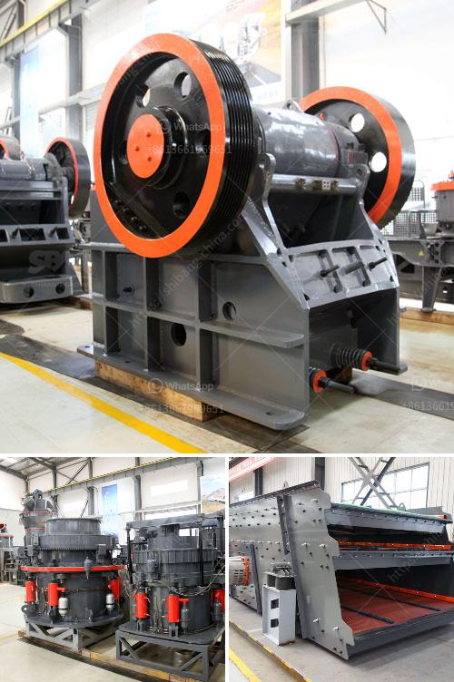

<h3>belt cost conveyor</h3>
The cost of a belt conveyor is an essential factor to consider when purchasing or investing in a new system for your business or industry. Belt conveyors are widely used in various industries to transport materials efficiently and effectively. This article will explore the factors that influence the cost of belt conveyors and provide insights into how to determine the most suitable conveyor system for your specific needs.

The cost of a belt conveyor can vary significantly depending on several factors. Firstly, the length and width of the conveyor play a crucial role in determining the cost. Longer and wider conveyors require more materials, such as belts, frames, and supports, which increase the overall cost. Moreover, longer conveyor systems may require additional components, such as multiple drive units, to ensure smooth operation and efficient transportation of large quantities of materials.

Secondly, the type of belt used in a conveyor system affects its cost. There are various types of belts available, including rubber, PVC, steel, and wire mesh belts, each with its unique advantages and price points. Rubber belts are commonly used in industries such as mining and construction due to their durability and performance, but they can be more expensive compared to PVC belts used in lighter-duty applications.

Additionally, the quality and design of the conveyor system components can significantly affect the cost. High-quality components, such as bearings, motors, and drives, may cost more initially but can result in better performance, reduced maintenance, and longer service life. It is crucial to select components from reputable manufacturers to ensure the reliability and longevity of the conveyor system.

Furthermore, the complexity of the conveyor system can impact the cost. Conveyor systems with intricate designs, such as those with multiple transfer points, diverters, or vertical integration, generally require more sophisticated engineering and fabrication, leading to higher costs. However, these complex systems may be necessary to meet specific operational requirements, such as handling fragile or irregularly shaped materials.

Another significant factor that influences the cost is the inclusion of additional features or accessories. Depending on the application, a conveyor system may require specialized features, such as belt cleaners, guides, or sensors, to ensure smooth operation and prevent material spillage. While these features add to the overall cost, they can improve efficiency, reduce downtime, and enhance safety in the long run.

Ultimately, determining the cost of a belt conveyor requires a comprehensive evaluation of your specific needs and requirements. Consider factors such as the length and width of the conveyor, type of belt, quality of components, complexity of the system, and additional features. Seeking advice from experts or consulting with conveyor system manufacturers can help you make an informed decision and choose a cost-effective solution that meets your operational goals.

In conclusion, the cost of a belt conveyor depends on various factors, including conveyor length and width, type of belt, quality of components, system complexity, and additional features. Careful consideration of these factors will enable you to select a conveyor system that suits your needs while providing a good balance between cost and performance. Remember, investing in a well-designed and high-quality conveyor system is a smart decision that can contribute to increased productivity and operational efficiency in the long run.
<h3>Contact us</h3><ul><li><strong>Whatsapp:&nbsp;<a href="https://wa.me/8613661969651">+8613661969651</a></strong></li><li><a href="https://swt.shibang-china.com/?git&amp;zhl&amp;belt cost conveyor"><strong>Online Service(chat now)</strong></a></li></ul><h3>Related</h3><ul><li><a href='costs of ball mills.md'>costs of ball mills</a></li><li><a href='quartz manufacturing plant in tamilnadu.md'>quartz manufacturing plant in tamilnadu</a></li><li><a href='uk quarry machinery manufacturers.md'>uk quarry machinery manufacturers</a></li><li><a href='quarry processing plant.md'>quarry processing plant</a></li><li><a href='price of stone crush machine in pakistan.md'>price of stone crush machine in pakistan</a></li></ul>