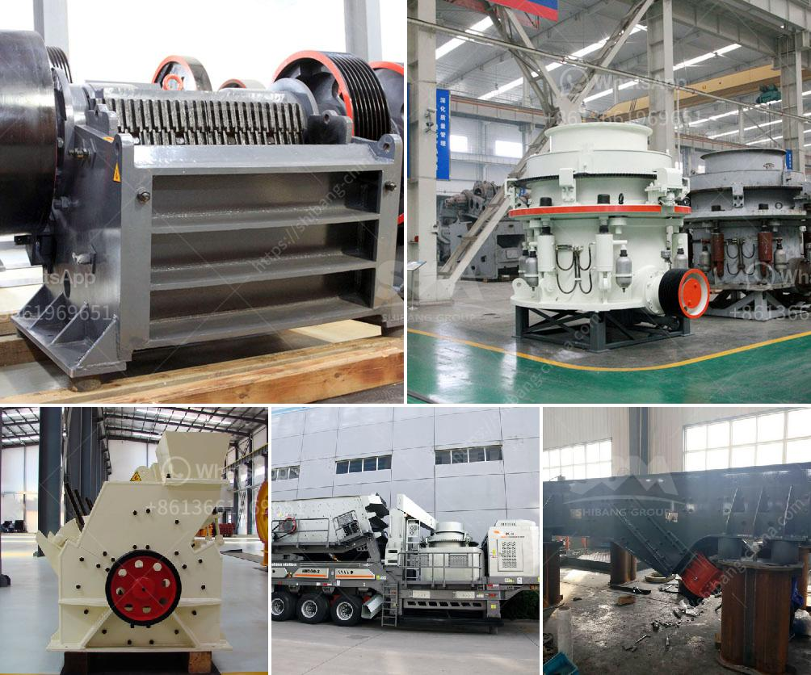

<h3>bentonite and barite milling machines</h3>
Bentonite and Barite are two widely used materials in various industries due to their unique properties. While Bentonite is primarily known for its ability to absorb water, Barite is renowned for its high specific gravity. Both materials are used for various purposes, ranging from drilling fluids in the oil and gas industry to pharmaceuticals and cosmetics.

To process these materials, milling machines are necessary. In the case of Bentonite, it is necessary to remove the gangue minerals before pulverizing to ensure a higher quality product. Generally, it requires initial crushing, drying, and milling stages to reduce the moisture content and achieve the desired grinding size.

Bentonite's unique properties make it an ideal material for drilling fluids in the oil and gas industry. It helps in lubricating and cooling the drill bit, removing cuttings, and preventing blowouts. Bentonite milling machines ensure the proper processing of Bentonite powders, which have various applications such as cosmetics, pharmaceuticals, and animal feed additives.

Similarly, Barite needs to be milled to a specific particle size to meet industry standards. Barite milling machines are ideal for this purpose as they help to grind the barite into fine particles. The high specific gravity of Barite makes it suitable for a wide range of industrial, medical, and manufacturing uses. It is commonly used as a weighting agent in drilling fluids to balance the pressure in drilling rigs and prevent formation damage.

Overall, Bentonite and Barite milling machines play a crucial role in the efficient and effective production of these materials. They ensure that the final products meet the required specifications for various industries. The proper processing of Bentonite and Barite results in high-quality materials that can be used in numerous applications across industries, contributing significantly to their economic importance.
<h3>Contact us</h3><ul><li><strong>Whatsapp:&nbsp;<a href="https://wa.me/8613661969651">+8613661969651</a></strong></li><li><a href="https://swt.shibang-china.com/?git&amp;zhl&amp;bentonite and barite milling machines"><strong>Online Service(chat now)</strong></a></li></ul><h3>Related</h3><ul><li><a href='diamond and gold washing plant.md'>diamond and gold washing plant</a></li><li><a href='processing on barite crushing.md'>processing on barite crushing</a></li><li><a href='enquiry about crusher.md'>enquiry about crusher</a></li><li><a href='feasibility report on block making industry in nigeria.md'>feasibility report on block making industry in nigeria</a></li><li><a href='ball mill for sale cagayan.md'>ball mill for sale cagayan</a></li></ul>