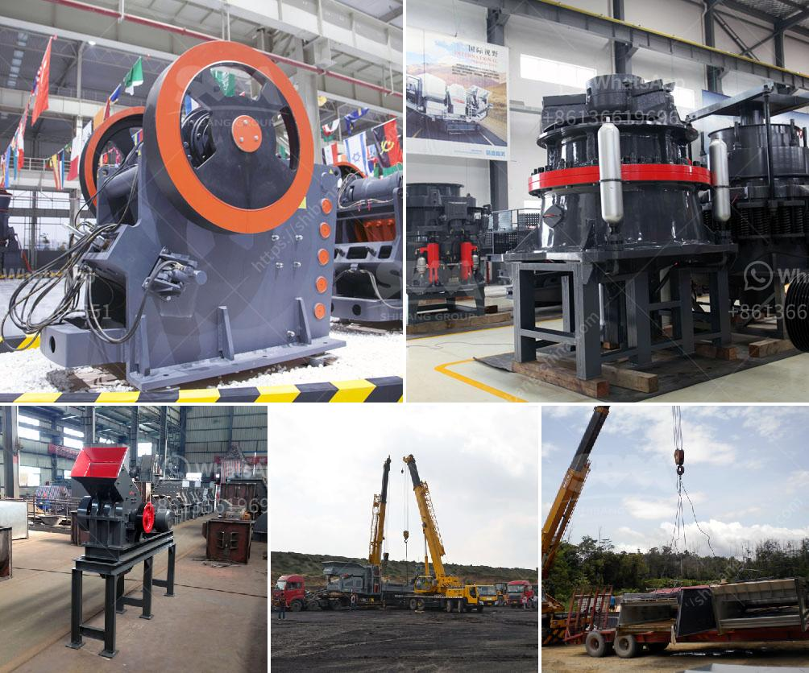

<h3>bentonite clay crusher for sale</h3>
Bentonite clay, known for its incredible adsorption and absorption properties, has recently gained popularity as a versatile and natural remedy for various health and beauty concerns. From detoxifying the body to improving skin conditions, bentonite clay is a powerful ingredient that has been used for centuries. With the rising demand for this natural wonder, the importance of a reliable and efficient crusher cannot be understated. Fortunately, there are numerous options available in the market, ensuring that anyone can find a bentonite clay crusher for sale that suits their specific needs.

One of the primary applications of bentonite clay is in the field of health and wellness. It is widely used for detoxifying the body, as it absorbs toxins and heavy metals when ingested. Additionally, when applied topically, bentonite clay can alleviate skin conditions such as acne, eczema, and psoriasis. The crusher plays a crucial role in the preparation of bentonite clay, ensuring that the clay is properly crushed and ready for use.

When considering a bentonite clay crusher for sale, it is essential to ensure that its crushing mechanism is strong and able to handle the challenging properties of the clay. To achieve this, many manufacturers use strong and durable materials for the construction of the crusher, such as stainless steel or cast iron. These materials not only ensure the longevity of the crusher but also prevent contamination of the crushed clay with foreign substances.

Another important factor to consider when purchasing a bentonite clay crusher is its efficiency and ease of use. The crusher should be able to break down the clay into fine and consistent particles without requiring excessive effort or manual intervention. Some crushers come equipped with automated features, such as adjustable settings and self-cleaning mechanisms, which enhance their overall efficiency and user-friendliness.

Additionally, the size and capacity of the crusher are crucial aspects to consider. These factors depend on the specific requirements of the user. For personal use or small-scale applications, a compact crusher with a lower capacity might suffice. On the other hand, industrial applications may require a larger crusher with a higher capacity to meet the demand.

When searching for a bentonite clay crusher for sale, it is also beneficial to consider additional features or accessories that might enhance the crusher's functionality. For instance, some crushers come with built-in dust collectors to prevent the release of dust during operation, ensuring a cleaner and safer working environment. Others may have adjustable paddles or hammers, allowing users to customize the crushing process and achieve the desired consistency.

In conclusion, bentonite clay is a versatile and valuable natural remedy, offering an array of health and beauty benefits. A reliable and efficient crusher is essential to unlock the true potential of this clay. When searching for a bentonite clay crusher for sale, factors such as construction materials, efficiency, ease of use, size, and capacity should be considered. By investing in a high-quality crusher, users can ensure that their bentonite clay is properly crushed and ready to deliver its incredible benefits.
<h3>Contact us</h3><ul><li><strong>Whatsapp:&nbsp;<a href="https://wa.me/8613661969651">+8613661969651</a></strong></li><li><a href="https://swt.shibang-china.com/?git&amp;zhl&amp;bentonite clay crusher for sale"><strong>Online Service(chat now)</strong></a></li></ul><h3>Related</h3><ul><li><a href='diagram of hammer mill machine.md'>diagram of hammer mill machine</a></li><li><a href='gypsum manufacturing equipment.md'>gypsum manufacturing equipment</a></li><li><a href='mobile gold processing plants 1 ton per.md'>mobile gold processing plants 1 ton per</a></li><li><a href='kenya jaw crushers south africa.md'>kenya jaw crushers south africa</a></li><li><a href='smallest gold crushing and washing plant.md'>smallest gold crushing and washing plant</a></li></ul>