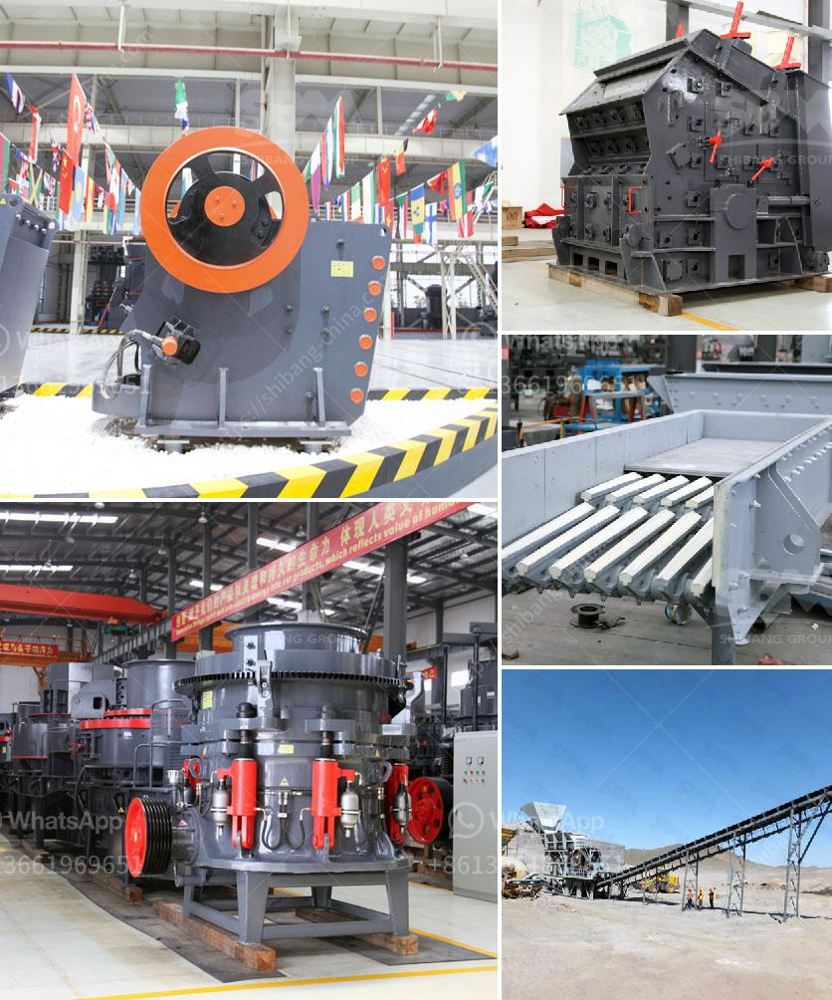

<h3>bentonite grinding mill</h3>
Bentonite is a non-metallic mineral that mainly consists of montmorillonite. It is incredibly versatile and has a wide range of applications across various industries. With the rapid development of the industrial sector, the demand for bentonite has increased, leading to a rise in the need for efficient grinding mills.

Grinding mills are crucial to the mineral processing industry. The material is broken into small pieces by crushers, and then sent to the grinding process. The grinding mill grinds bentonite into powders or particles for final applications. The bentonite grinding mill can produce different fineness and capacity, which can be adjusted according to different requirements.

Bentonite is a clay mineral, which is largely composed of montmorillonite. It is mainly used as a drilling mud, absorbent, binder, and filler in various industries such as construction, oil and gas, drilling, agriculture, and pharmaceuticals. In the construction industry, bentonite is used as a waterproofing agent to prevent leakage and seepage in foundations, basements, and tunnels. It is also used in the production of paints, adhesives, and sealants.

To meet the growing demand for bentonite, grinding mills have become essential equipment. The most commonly used grinding mills include Raymond mill, high-pressure grinding mill, and ultrafine grinding mill.

Raymond mill is a commonly used equipment in the grinding industry. It has a wide range of applications, including dolomite, marble, limestone, gypsum, talcum, mica, bentonite, coal, etc. The grinding cavity of Raymond mill has a strong load capacity and can grind materials with a Mohs hardness of up to 7 or less.

High-pressure grinding mill is mainly used for processing materials with a Mohs hardness of 9.3 or less and moisture content below 6%. It can process various non-flammable and explosive mineral materials with a humidity below 6%. The fineness of the finished product can be adjusted from 30-425 mesh.

Ultrafine grinding mill is an ideal choice for grinding 800-2500 mesh powder. It is equipped with a pulse dust collector to achieve 99% dust collection efficiency.

In addition to the above grinding mills, some customers may also prefer to use a ball mill or vertical roller mill to achieve the desired fineness.

When selecting a bentonite grinding mill, there are several factors to consider. Firstly, the fineness of the finished product should meet the requirements. Secondly, the production capacity should match the market demand. Thirdly, the grinding mill should have a reasonable price and good after-sales service to ensure long-term use.

In conclusion, bentonite grinding mills are essential equipment in the mineral processing industry. They are used to grind bentonite into powders or particles for various applications. Raymond mill, high-pressure grinding mill, and ultrafine grinding mill are commonly used grinding mills. When choosing a grinding mill, factors such as fineness, production capacity, price, and after-sales service should be considered. With the continuous development of the industrial sector, the demand for bentonite grinding mills will continue to rise.
<h3>Contact us</h3><ul><li><strong>Whatsapp:&nbsp;<a href="https://wa.me/8613661969651">+8613661969651</a></strong></li><li><a href="https://swt.shibang-china.com/?git&amp;zhl&amp;bentonite grinding mill"><strong>Online Service(chat now)</strong></a></li></ul><h3>Related</h3><ul><li><a href='impact crusher for sale johannesburg.md'>impact crusher for sale johannesburg</a></li><li><a href='automatic stone crusher plant.md'>automatic stone crusher plant</a></li><li><a href='second hand sand making machine cost.md'>second hand sand making machine cost</a></li><li><a href='small portable rock crushers for sale africa.md'>small portable rock crushers for sale africa</a></li><li><a href='stone crushing machine for sale.md'>stone crushing machine for sale</a></li></ul>