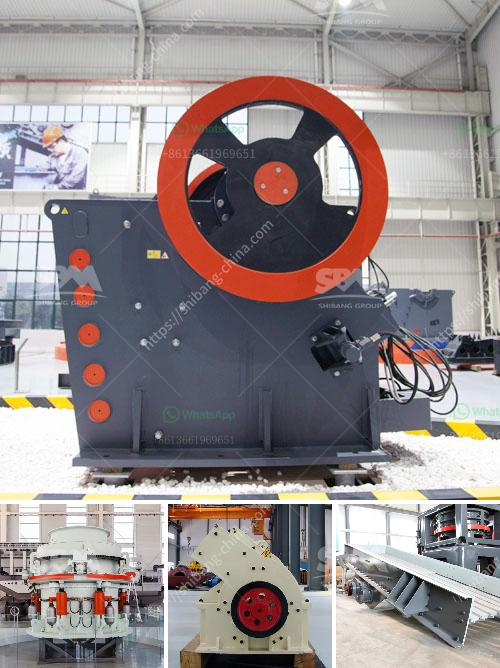

<h3>bentonite processing</h3>
Bentonite is a versatile clay that is commonly used in various industries, including construction, drilling, and agriculture. It is known for its ability to swell and absorb liquids, which makes it highly valuable in various applications.

The processing of bentonite involves several steps to extract the mineral from the earth and prepare it for use. The process typically begins with exploration, as geologists identify potential bentonite deposits. Once a suitable deposit is found, mining operations begin to extract the bentonite ore.

The ore is then transported to a processing plant, where it undergoes several stages of crushing, drying, milling, and classifying. These processes reduce the size of the ore and separate impurities to obtain the desired bentonite product.

During the milling stage, the ore is further pulverized into a fine powder. This powder undergoes treatment, such as chemical activation or heat activation, to enhance its properties. Chemical activation involves treating the bentonite with various chemicals to improve its adsorption and swelling capacities. Heat activation, on the other hand, involves heating the bentonite to a specific temperature to enhance its performance.

After processing, the bentonite is typically packaged and distributed for various applications. In the construction industry, bentonite is commonly used as a waterproofing material for foundations, tunnels, and retaining walls. Its ability to swell and create an impermeable barrier makes it an excellent choice for these purposes.

In the drilling industry, bentonite is used as a drilling fluid or mud. It is mixed with water to create a slurry that lubricates the drill bit, cools the drilling equipment, and carries cuttings to the surface. This helps to prevent the collapse of the wellbore and ensures smooth drilling operations.

In agriculture, bentonite is used as a soil amendment to improve the quality of soils. It helps to enhance water retention, improve nutrient availability, and reduce soil erosion. By incorporating bentonite into the soil, farmers can improve crop yields and overall soil health.

In conclusion, bentonite processing is a crucial step in harnessing the full potential of this versatile clay. The process involves mining, milling, and treating the ore to obtain the desired bentonite product. It is used in various industries, including construction, drilling, and agriculture, due to its unique properties. Whether it is improving the strength of foundations, facilitating smooth drilling operations, or enhancing soil fertility, bentonite plays a vital role in many applications.
<h3>Contact us</h3><ul><li><strong>Whatsapp:&nbsp;<a href="https://wa.me/8613661969651">+8613661969651</a></strong></li><li><a href="https://swt.shibang-china.com/?git&amp;zhl&amp;bentonite processing"><strong>Online Service(chat now)</strong></a></li></ul><h3>Related</h3><ul><li><a href='mini cement plant capacity of ton per day.md'>mini cement plant capacity of ton per day</a></li><li><a href='ball mill modual continuous ball mill.md'>ball mill modual continuous ball mill</a></li><li><a href='coal pulverizer crusher manufacturers in india.md'>coal pulverizer crusher manufacturers in india</a></li><li><a href='cone crusher design guideline pdf.md'>cone crusher design guideline pdf</a></li><li><a href='coal washing plants for rental in malaysia.md'>coal washing plants for rental in malaysia</a></li></ul>