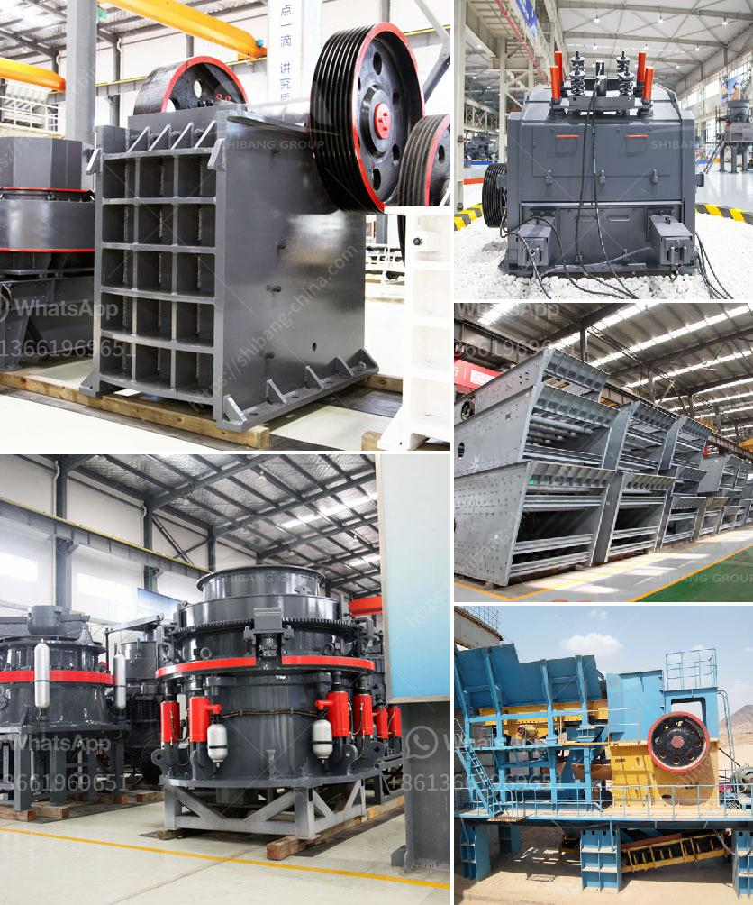

<h3>bentonite pulverizer crusher manufacturer</h3>
Bentonite is a highly versatile mineral that has been used for centuries in various industries. It is the main component of bentonite clay, which is a natural absorbent and binder. Due to its unique properties, bentonite has become an essential material in many manufacturing processes. One important machine used for this purpose is the bentonite pulverizer crusher.

A bentonite pulverizer crusher is a machine designed to crush and grind large pieces of bentonite into fine powder. This powder can be used in various industrial applications such as drilling mud, binder, foundry sand, binder in iron ore pelletization, and as a wastewater treatment additive. It is important to choose a reliable bentonite pulverizer crusher manufacturer to ensure the quality and efficiency of the machine.

There are many manufacturers of bentonite pulverizer crushers in the market, but not all of them are created equal. When choosing a manufacturer, it is important to consider several factors such as experience, reputation, and customer reviews. A manufacturer with years of experience in manufacturing pulverizer crushers will have a better understanding of the requirements and challenges in the industry.

Reputation is another important factor to consider when choosing a bentonite pulverizer crusher manufacturer. A manufacturer with a good reputation is more likely to provide high-quality products and reliable customer support. Reading customer reviews and testimonials can give you insights into the manufacturer's reputation and the satisfaction of previous customers.

In addition to experience and reputation, it is also important to consider the technical specifications and features offered by the manufacturer. Different manufacturers may offer different types of pulverizer crushers with varying capacities, power requirements, and additional features. It is important to choose a crusher that meets your specific requirements and production needs.

When choosing a bentonite pulverizer crusher manufacturer, it is also important to consider the after-sales service and technical support provided. A good manufacturer will provide comprehensive technical support, spare parts, and troubleshooting assistance to ensure the smooth operation of the machine. Additionally, a warranty on the machine can provide peace of mind and protect you against any manufacturing defects.

In conclusion, choosing a reliable bentonite pulverizer crusher manufacturer is crucial for the success of your manufacturing process. By considering factors such as experience, reputation, technical specifications, and after-sales support, you can ensure that you get a high-quality machine that meets your specific requirements. Investing in a quality crusher will not only improve the efficiency and productivity of your process but also contribute to the overall success of your business.
<h3>Contact us</h3><ul><li><strong>Whatsapp:&nbsp;<a href="https://wa.me/8613661969651">+8613661969651</a></strong></li><li><a href="https://swt.shibang-china.com/?git&amp;zhl&amp;bentonite pulverizer crusher manufacturer"><strong>Online Service(chat now)</strong></a></li></ul><h3>Related</h3><ul><li><a href='gold sand separation equipment philippines.md'>gold sand separation equipment philippines</a></li><li><a href='stone ball mill suppler kenya.md'>stone ball mill suppler kenya</a></li><li><a href='fine powder milling machines.md'>fine powder milling machines</a></li><li><a href='calcite and dolomite plant process.md'>calcite and dolomite plant process</a></li><li><a href='ethiopia gypsum machinery supplier.md'>ethiopia gypsum machinery supplier</a></li></ul>