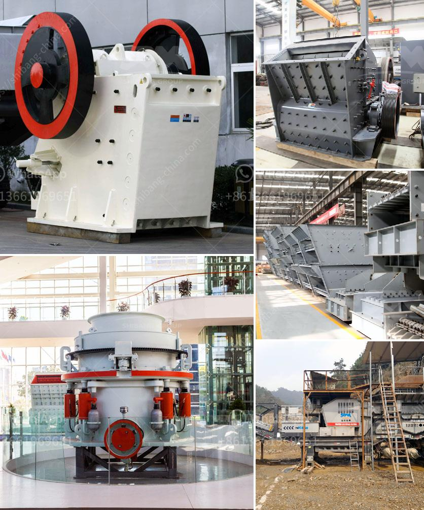

<h3>best coal crusher machine pdf</h3>
Coal crusher machines are used to crush coal into small-sized particles for industrial applications. Coal crushers are popular for crushing coal with high moisture content, making them ideal for coal washing plants or coal briquette production lines. They are suitable for both primary and secondary crushing processes.

The best coal crusher machine PDF offers a wide range of applications and advantages. Firstly, it is equipped with a dust collection system to prevent dust pollution. This ensures a clean and healthy working environment for operators. Additionally, it features a unique crushing method that minimizes coal dust and noise generation.

Secondly, the machine is efficient and provides high throughput rates. Its large crushing capacity allows it to process coal quickly and efficiently, increasing productivity and saving time. Moreover, the adjustable discharge size ensures that the crushed coal meets specific requirements.

Thirdly, the coal crusher machine is easy to operate and maintain. It has a user-friendly control panel that allows operators to adjust the settings and monitor the machine's performance. Routine maintenance is straightforward, ensuring the longevity and reliability of the equipment.

Additionally, the best coal crusher machine PDF is designed with safety features. It includes an emergency stop button and safety guards to protect operators from potential hazards during operation. These safety measures are crucial for preventing accidents and ensuring personnel safety.

In conclusion, the best coal crusher machine PDF is a versatile and efficient machine that provides reliable performance in coal crushing applications. Its dust collection system, high throughput rates, adjustable discharge size, easy operation and maintenance, and safety features make it an excellent choice for industries dealing with coal processing. Whether for coal washing plants or coal briquette production lines, this machine is a valuable tool for maximizing productivity and maintaining a clean, safe, and efficient working environment.
<h3>Contact us</h3><ul><li><strong>Whatsapp:&nbsp;<a href="https://wa.me/8613661969651">+8613661969651</a></strong></li><li><a href="https://swt.shibang-china.com/?git&amp;zhl&amp;best coal crusher machine pdf"><strong>Online Service(chat now)</strong></a></li></ul><h3>Related</h3><ul><li><a href='vertical cement mill grinding plant.md'>vertical cement mill grinding plant</a></li><li><a href='stone crusher for gold mining in south africa.md'>stone crusher for gold mining in south africa</a></li><li><a href='types of vibratory screens.md'>types of vibratory screens</a></li><li><a href='crusher sand machine south africa.md'>crusher sand machine south africa</a></li><li><a href='cost of conveyor belt system for coal loading.md'>cost of conveyor belt system for coal loading</a></li></ul>