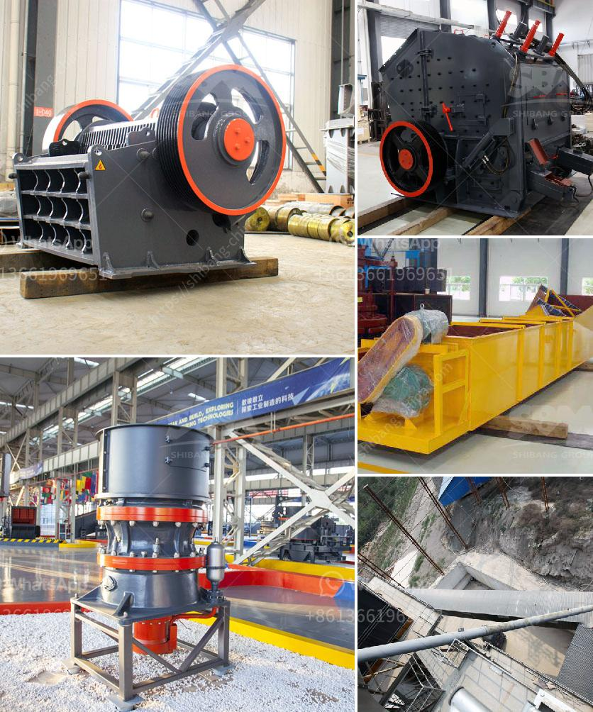

<h3>best crushers for manufactured sand</h3>
When it comes to choosing the right equipment for producing manufactured sand, crushers play a crucial role. Crushers are essential machines that break down large stones into more manageable sizes, making them suitable for construction purposes. In this article, we will discuss some of the best crushers for manufactured sand.

1. Jaw Crushers: Jaw crushers are commonly used as primary crushers. They have a sturdy construction and are capable of handling large rocks. Jaw crushers utilize a compressive force to crush the material between two vertical jaws, one fixed and the other moving. This type of crusher produces a uniform and cubical-shaped end product, making it ideal for manufactured sand production.

2. Cone Crushers: Cone crushers are known for their versatility and high capacity. They have a cone-shaped crushing head that rotates continuously, applying pressure to the material and crushing it against the stationary bowl liner. Cone crushers are suitable for producing manufactured sand with consistent particle shape and size.

3. Impact Crushers: Impact crushers use the principles of impact crushing to reduce the size of materials. They are often used in the production of manufactured sand due to their ability to produce a well-graded and cubical product. Impact crushers are versatile machines that can handle various types of rock and different feed materials.

4. VSI Crushers: VSI (Vertical Shaft Impactor) crushers are specifically designed to produce manufactured sand. They employ a high-speed rotor with anvils or a rock-on-rock crushing chamber. VSI crushers offer excellent particle shape and are highly efficient in producing sand with a well-graded and consistent fineness modulus.

5. HSI Crushers: HSI (Horizontal Shaft Impactor) crushers are efficient machines for primary and secondary crushing. They are suitable for producing manufactured sand with high reduction ratios, making them a popular choice in the sand production industry.

In conclusion, choosing the right crusher for manufactured sand production is essential for producing high-quality sand that meets construction standards. Jaw crushers, cone crushers, impact crushers, VSI crushers, and HSI crushers are among the best options available. Each has its own advantages and can contribute to the production of consistent and superior-quality manufactured sand.
<h3>Contact us</h3><ul><li><strong>Whatsapp:&nbsp;<a href="https://wa.me/8613661969651">+8613661969651</a></strong></li><li><a href="https://swt.shibang-china.com/?git&amp;zhl&amp;best crushers for manufactured sand"><strong>Online Service(chat now)</strong></a></li></ul><h3>Related</h3><ul><li><a href='talcum powder making machinery.md'>talcum powder making machinery</a></li><li><a href='mobile stone crushing plants price.md'>mobile stone crushing plants price</a></li><li><a href='small quarry crusher for sale.md'>small quarry crusher for sale</a></li><li><a href='gold washing machine from rock.md'>gold washing machine from rock</a></li><li><a href='clay grinding mill machine price in china.md'>clay grinding mill machine price in china</a></li></ul>