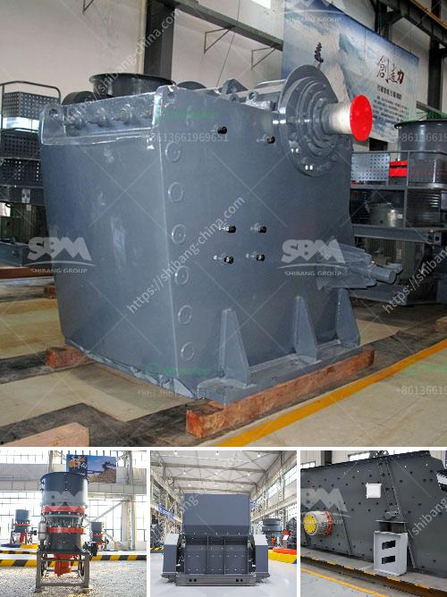

<h3>best machine for coal grinding</h3>
Coal grinding is an essential process for creating solid fuel, widely used in power plants, cement factories, and other industrial sectors. To maximize energy production and reduce environmental impact, selecting the right equipment is crucial. In this article, we will explore some of the best machines available for coal grinding, ensuring efficient operations and high-quality pulverized coal.

Ball mills are commonly used machines for coal grinding due to their versatility and reliability. These rotating cylinders contain a large quantity of steel balls, which crush and grind the coal into fine powder. The ball mill process is highly energy-intensive, requiring substantial power input to ensure proper pulverization. However, it offers excellent grinding efficiency and can handle various coal types.

Vertical roller mills have gained significant popularity in recent years, surpassing traditional ball mills due to their superior energy efficiency. VRMs utilize large rollers to grind the coal directly on a rotating table. This design reduces the need for steel balls, minimizing abrasion and decreasing maintenance costs. Additionally, VRMs allow for better control over the grinding process, resulting in a more consistent and finer coal powder.

High-speed attrition mills, such as the cage mills or hammer mills, are another option for efficient coal grinding. These machines utilize multiple rotating hammers or cages to pulverize the coal by impact and attrition. They are favored for their simplicity, low initial cost, and flexibility to handle various coal sizes and moisture levels. However, they tend to have lower grinding efficiency compared to ball mills or VRMs.

Bowl mills, also known as medium-speed mills, are commonly used in coal-fired power plants for grinding coal. These mills consist of a rotating bowl or table and a set of rollers or tires positioned inside. The coal is crushed between the rotating bowl and the rollers, converting it into fine powder. Bowl mills offer good grinding efficiency and are suitable for handling high moisture coal. However, they require a higher power input and maintenance compared to other options.

Impact mills are ideal for grinding softer coal types or materials with high moisture content. These machines rely on high-speed rotating hammers or pins to crush and pulverize the coal. Impact mills are highly versatile and can accommodate different feed sizes. They also tend to have lower power requirements and maintenance compared to other coal grinding machines. However, they may produce coarser coal particles and can be more susceptible to wear.

When it comes to coal grinding, selecting the best machine for the job is crucial to achieve optimal performance and energy efficiency. Ball mills, vertical roller mills, high-speed attrition mills, bowl mills, and impact mills all offer distinct advantages depending on the specific grinding requirements. Evaluating the coal type, grinding capacity, maintenance needs, and desired particle size will help determine the most suitable machine for coal grinding.

Investing in the right equipment ensures a consistent supply of high-quality pulverized coal, influencing the overall efficiency and environmental impact of active coal-based facilities.
<h3>Contact us</h3><ul><li><strong>Whatsapp:&nbsp;<a href="https://wa.me/8613661969651">+8613661969651</a></strong></li><li><a href="https://swt.shibang-china.com/?git&amp;zhl&amp;best machine for coal grinding"><strong>Online Service(chat now)</strong></a></li></ul><h3>Related</h3><ul><li><a href='calcite micronized manufacturing plant pdf.md'>calcite micronized manufacturing plant pdf</a></li><li><a href='stone crusher in inda or parkistan.md'>stone crusher in inda or parkistan</a></li><li><a href='jaw crushers machine for sale.md'>jaw crushers machine for sale</a></li><li><a href='stone crashers price in south africa.md'>stone crashers price in south africa</a></li><li><a href='ball mill sale in malaysia.md'>ball mill sale in malaysia</a></li></ul>