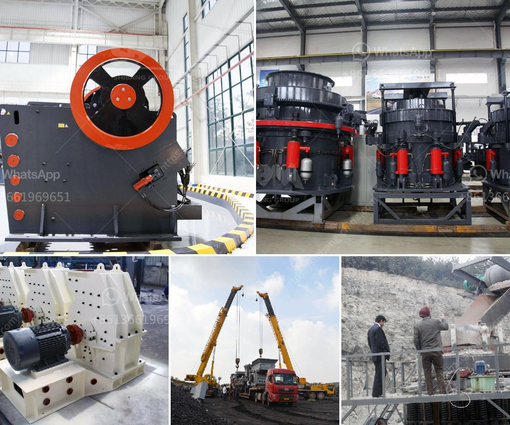

<h3>big slage crusher mechins plant</h3>
Big slage crusher machines plants are increasingly being used in the recycling industry to break down large pieces of slag into smaller, more manageable sizes. Slag, a byproduct of various metal manufacturing processes, poses challenges when it comes to disposal and recycling. However, with the use of these specialized machines, the task of handling slag becomes much easier and more efficient.

One of the key advantages of the big slage crusher machines is their ability to crush large pieces of slag into smaller, more uniform sizes. These machines are equipped with high-strength and wear-resistant blades that efficiently break down large chunks of slag into smaller pieces. This allows for easier handling, transportation, and recycling of the slag.

Furthermore, these big slage crusher machines can also be used to process materials such as limestone, gypsum, coal, and various other minerals. In addition to slag recycling, the mining industry can also benefit from these machines. For example, in the coal mining industry, the extracted coal can be further processed into smaller sizes using slage crushers. This not only increases the efficiency of coal utilization but also reduces the environmental impact of coal mining and combustion.

The design of big slage crusher machines takes into consideration various factors such as the size and hardness of the materials to be processed, the desired output size, and the capacity requirements. Manufacturers of these machines offer a wide range of models with different specifications to cater to the unique needs of different industries. Some machines may feature single or double shafts, while others may have various options for speed and power configurations. Additionally, advanced control systems are often integrated into these machines to ensure optimal performance and energy efficiency.

Operating a big slage crusher machine is relatively straightforward. After the material is fed into the machine, the blades rotate at high speeds, effectively breaking down the material into smaller pieces. The crushed material is then discharged through a screen or conveyor belt, depending on the desired output size. Regular maintenance, including blade sharpening and lubrication, is necessary to maintain the machine's efficiency and prolong its lifespan.

In summary, big slage crusher machines plants are revolutionizing the recycling and mining industries by making it easier and more efficient to process large pieces of slag and other materials. These machines not only enhance the utilization of resources but also contribute to minimizing the environmental impact of various industries. As technology continues to advance, we can expect further improvements and innovations in these machines to further boost their efficiency and effectiveness.
<h3>Contact us</h3><ul><li><strong>Whatsapp:&nbsp;<a href="https://wa.me/8613661969651">+8613661969651</a></strong></li><li><a href="https://swt.shibang-china.com/?git&amp;zhl&amp;big slage crusher mechins plant"><strong>Online Service(chat now)</strong></a></li></ul><h3>Related</h3><ul><li><a href='how to start sand business in nigeria.md'>how to start sand business in nigeria</a></li><li><a href='talcum powder manufacturing process.md'>talcum powder manufacturing process</a></li><li><a href='crushing machines for rent in uae.md'>crushing machines for rent in uae</a></li><li><a href='used gold crushing for sale in uae.md'>used gold crushing for sale in uae</a></li><li><a href='gold processing machinery in china.md'>gold processing machinery in china</a></li></ul>