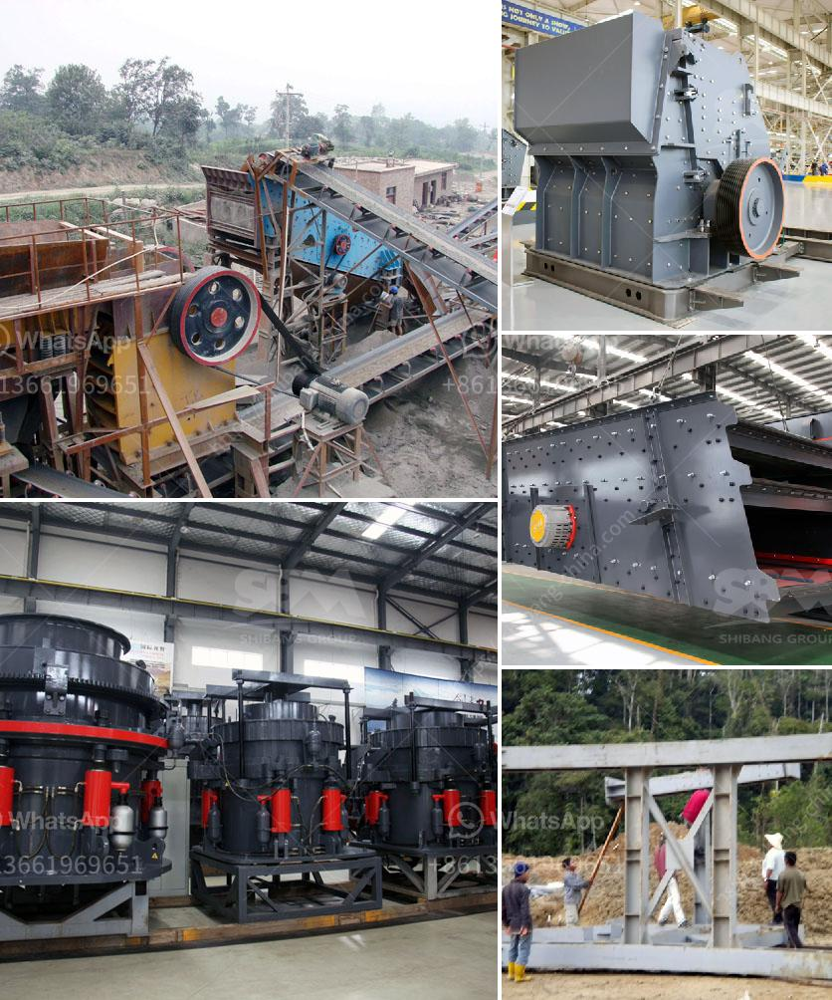

<h3>biggest crucher in kenya</h3>
Kenya is a nation brimming with talented individuals, each leaving their unique mark on the country's cultural landscape. From award-winning actors, musicians, and sports personalities to influential politicians and celebrated activists, Kenya boasts a diverse range of celebrities who have captured the nation's hearts. Today, let's delve into some of Kenya's biggest crushes, those revered figures who have become symbols of inspiration and national pride.

Starting off our list of irresistible crushes is none other than the talented actress Lupita Nyong'o. Born in Mexico to Kenyan parents, Lupita rose to international prominence after winning an Academy Award for her stunning performance in "12 Years a Slave." With grace, eloquence, and exceptional beauty, she quickly became a global icon, representing Kenya on the global stage. Lupita's talent and advocacy for inclusivity have made her a role model for aspiring actors and actress in Kenya and beyond.

Most Kenyan sports enthusiasts would agree that Eliud Kipchoge is the epitome of greatness. As the world's greatest marathon runner, Kipchoge has set numerous records and defied all odds. His history-making feat, completing the marathon in under two hours during the INEOS 1:59 Challenge, brought Kenya immense pride. Eliud's determination, humility, and discipline have inspired many budding athletes, making him one of the nation's most adored figures.

In the realm of music, Sauti Sol has garnered a massive following not only in Kenya but across the continent. This sensational Afro-pop band has consistently released chart-topping hits, blending various musical genres while staying true to their African roots. The group's talent, energetic performances, and unique style have won the hearts of millions, making them one of Kenya's biggest musical crushes. 

Wangari Maathai remains an eternal inspiration for environmental conservationists and activists worldwide. As the first African woman to win the Nobel Peace Prize, Maathai was a passionate advocate for sustainable development, democracy, and the environment. Through her Green Belt Movement, she spearheaded tree-planting initiatives, empowering communities and fighting against deforestation. Maathai's courage and indomitable spirit live on as she continues to inspire generations to protect our planet.

While not an individual per se, the Sauti za Busara festival deserves mention as Kenya's largest music festival, attracting musicians and music enthusiasts from all walks of life. Taking place annually in Zanzibar, this festival celebrates the diverse rhythms and melodies of Africa. Artists from Kenya, as well as other African countries, showcase their musical prowess, nurturing newfound talents and bridging cultural gaps. The festival's electrifying performances create a collective crush on African music and promote creative exchange.

Kenya's biggest crushes epitomize the nation's unique blend of talent, creativity, and resilience. Each of these personalities has captivated the country and left an indelible mark on their respective fields. From Lupita Nyong'o's global stardom to Eliud Kipchoge's record-breaking feats and the enchanting music of Sauti Sol, Kenya's crushes inspire, motivate, and ignite a sense of national pride. As their stories illuminate the path for future generations, these iconic individuals collectively shape the nation's cultural identity.
<h3>Contact us</h3><ul><li><strong>Whatsapp:&nbsp;<a href="https://wa.me/8613661969651">+8613661969651</a></strong></li><li><a href="https://swt.shibang-china.com/?git&amp;zhl&amp;biggest crucher in kenya"><strong>Online Service(chat now)</strong></a></li></ul><h3>Related</h3><ul><li><a href='project on stone crushing unit.md'>project on stone crushing unit</a></li><li><a href='vertical roller mill manufacture in tamilnadu.md'>vertical roller mill manufacture in tamilnadu</a></li><li><a href='spare parts for raymond mill.md'>spare parts for raymond mill</a></li><li><a href='prices for cement processing machines.md'>prices for cement processing machines</a></li><li><a href='marble mining equipment.md'>marble mining equipment</a></li></ul>