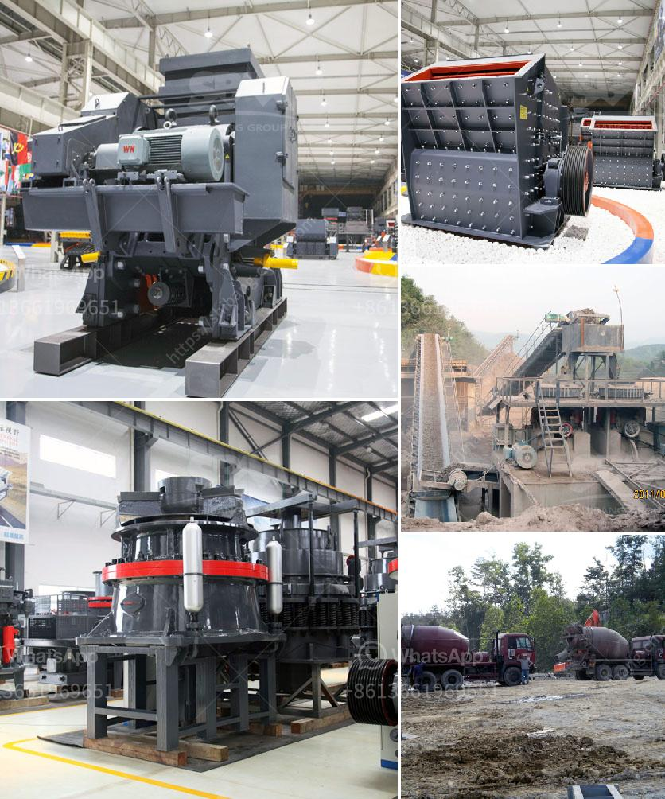

<h3>biggest rock crusher</h3>
The rock crusher is a monstrous machine that processes a mixture of rock and table salt into a fine sand-like substance. The machine is equipped with gigantic steel teeth that pulverize the rock and reduce it to smaller stones. After being crushed, the rocks are sorted into different sizes using screens, which determine the final product's specifications.

Among the many rock crushers available on the market, one of the largest is the biggest rock crusher. With its mammoth size, this crushing machine is aptly named. It is commonly used in construction, mining, and aggregate industries, where it breaks down large stones into manageable pieces.

The biggest rock crusher has a robust design and can handle the most demanding crushing applications. It is powered by a formidable engine that generates enough torque to pulverize any rock it encounters. This powerful machine can handle even the toughest materials, including granite, limestone, and concrete.

With its immense crushing capacity, the biggest rock crusher can produce large quantities of crushed rocks in a short period. This is particularly beneficial for large-scale construction projects that require a steady supply of crushed rock, such as road construction, building foundations, and landscaping.

The machine's large size and robust engineering make it perfect for big construction sites. It can effortlessly crush enormous rocks into small fragments, allowing them to be easily transported and used for various purposes. The crushed rocks can be used for road surfacing, constructing building foundations, manufacturing concrete, or creating decorative elements in landscaping.

Not only does the biggest rock crusher provide efficient crushing capabilities, but it also offers high durability and reliability. Its heavy-duty construction ensures that it can withstand the toughest working conditions without breaking down. This reduces the downtime and maximizes productivity, making the machine an indispensable tool in the construction industry.

In addition to its size and strength, the biggest rock crusher is also equipped with advanced features that enhance its performance. It has a sophisticated control system that allows operators to monitor and adjust various parameters, ensuring precise crushing and optimal output. The machine also incorporates safety features to protect operators and prevent accidents, making it a safe and reliable choice for any construction project.

Overall, the biggest rock crusher is a remarkable machine that offers unmatched performance, durability, and versatility. With its immense size and crushing power, it can handle the largest rocks with ease, making it an essential tool for any construction site. Whether it's for road construction, building foundations, or landscaping, this machine is sure to deliver exceptional results. Its advanced features and robust design make it a reliable and efficient choice for any crushing application. If you're in need of a crushing machine that can handle the biggest rocks, look no further than the biggest rock crusher.
<h3>Contact us</h3><ul><li><strong>Whatsapp:&nbsp;<a href="https://wa.me/8613661969651">+8613661969651</a></strong></li><li><a href="https://swt.shibang-china.com/?git&amp;zhl&amp;biggest rock crusher"><strong>Online Service(chat now)</strong></a></li></ul><h3>Related</h3><ul><li><a href='jaw crushers for sale south africa.md'>jaw crushers for sale south africa</a></li><li><a href='mill price of hammer mill.md'>mill price of hammer mill</a></li><li><a href='price of zenith stone crusher.md'>price of zenith stone crusher</a></li><li><a href='stone quarry crusher companies in ghana.md'>stone quarry crusher companies in ghana</a></li><li><a href='stone crush plant 4tph.md'>stone crush plant 4tph</a></li></ul>