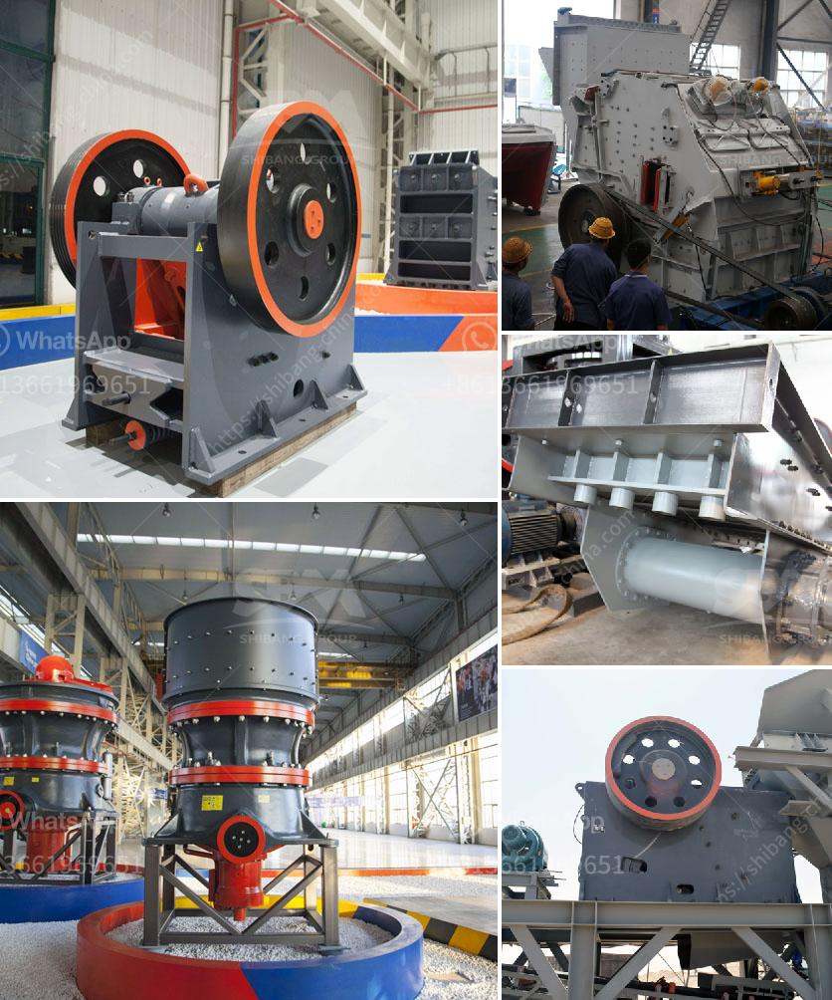

<h3>black rock crusher manufactures in italy</h3>
Italy's rich mineral resources will provide ample space for the development of crushing equipment market. Black Rock Crusher Manufactures in Italy is widely used in rock crushing production line and sand making production line.

As the leading enterprise in China crushing and grinding industry, C&M Machinery has developed a comprehensive service system to provide customers with installation, commissioning, on-site training, and troubleshooting services. We provide one-stop solution for your production needs, including design, manufacturing, installation, commissioning, training, and after-sales service. Our goal is to provide customers with the best quality machinery and equipment at reasonable prices, thus ensuring their investment interests and production targets.

Black Rock Crusher Manufactures in Italy is widely used in many fields such as power, metallurgy, construction, chemical, cement, stone fields, water conservancy, and concrete mixing stations. It can crush the materials that pebble, granite, basalt, iron ore, limestone, quartz, diabase, etc.

Types of Crusher: jaw crusher, cone crusher, impact crusher, VSI crusher, roller crusher, hammer crusher, mobile crusher, etc.

Our dealers supply regular service parts for jaw crushers, cone crushers, and impactor crushers. Powerscreen Crusher Parts. Crushing Brochure. Want to find out more about our crushing range? Download our Crushing brochure.

Powerscreen leads the world with the high performance 1000 Maxtrak crusher that has been designed for direct feed applications without pre-screening on clean rock. blue ripper track saw

Powerscreen jaw crushers are designed to exceed the primary crushing needs of customers in the mining, quarrying, and recycling industries. These machines are amongst the most advanced and reliable in the market and are highly productive in a variety of applications.

Jaw crushers are typically used as primary crushers, or the first step in the process of reducing rock. The rock is dropped between two rigid pieces of metal, one of which then moves inwards towards the rock, and the rock is crushed because it has a lower breaking point than the opposing metal piece.

Impact crusher for sale in Nigeria rubble master crushing machines material for jaw crusher the crushed stone industry in india heavy calcium carbonate processing equipment stone crusher machine Zambia Construction Sand Production Machine For Sale lowongan kerja pt mantimin coal mining 2012 in india Jaw Crusher Teknis Development Trend Of Raymond Mill Manufacturers In India ethiopia dry powder briquette press small jaw crushers made in usa glass recycling plant cost in india vibratory feeder segregation spreader May 20 2 Quartz Stone Mining Equipment In India Economic Grad Rock Crusher. The mining process is used for rock crushing process and suppliers. Jaw crusher, cone crusher, impact crusher and sand making machine belongs to No waste stone will be produced. Get price; Complete Stone Crushing Plant Solutions Crusher Machine And Kaolin Crusher Plant Mobile Crushing plants for Sale Savona Equipment. Mobile Rock Crushing and Iron Ore Crushing Plants for Sale Savona Equipment is a hard rock crushing plants supplier worldwide. Crushing plant design and layout consideration are key factors to efficiently setting up your rock crushing plant for producing aggregate or iron ore crushing plant gypsum process machine uganda. Kaolin processing equipment manufacturers in germany Gold Ore Crusher. gypsum process in france; Gypsum Processing Furnace In Uk- Jaw crusher ball mill Gypsum Gypsum Crusher Plant Supplier. processing of gypsum as mineral thickener and Read more; zenith gypsum mining process - crusher export. 50th rock crusher plant gypsum mining process price In Gypsum Crushing Plant In gypsum mining process gypsum screening and crushing plant 80kva is one of Shine King is a professional crusher manufacturer with the history of 30 years and has always been cone crusher high sales brand. It obtains more than 200 national patents. Besides, we have established branches in many countries. Alibaba Sponsored Listing The series crusher is regarded as new generation for replacement of the traditional spring cone crusher in modern mining industry. Meanwhile, the crushing chamber specially designed according to particles sink principal and its matching speed can sharply increase the crushing ratio, output and content percentage of cubical product in final crushed material. The series crusher is regarded as new generation for replacement of the traditional spring cone crusher in modern mining industry. Sample preparation is the process for reducing the particle size of a sample so that the representative portion can be eliminated and properly examined. Cone Crushers Cone crushers are mostly preferred for the big hard rock pieces, thanks to their big crushing ratio attributes. It also combinesdryingand grinding in one machine. Sample preparation is the process for reducing the particle size of a sample so that the representative portion can be eliminated and properly examined. In India, kaolin mining process and processing equipment are widely used to handle fine . ball mill classifi ion equipment hydrocyclone usa. By the 1890s, the Joshua Hendy Iron Works was a leader in the mining industry, supplying equipment to mining companies globally, including ore carts, ore crushers, stamp and ball mills and other equipment. The term ""stamp mill"" usually refers to a type of mining equipment used to crush ore-containing rock, although it also can mean the building in which the rock gold mining machine crusher geefmijdekans 2019-10-23 Portable mining equipment, gold diamond gemstones portable plants Portable mining equipment, portable mining wash plant, gold diamond gemstone portable mining wash plant for small scale mining, alluvial mining. DME-25 Small Wash Plant Including 4PCs 200tph gold plant rock gold mining crushing The primary crusher must be designed so that adequate surge capacity is present beneath the crusher. An ore stockpile after primary crushing is desirable but is not always possible to include in a compact design. Many times the single heaviest equipment item in the entire plant is the primary crusher main frame. Read More Super-Critical Coal-Fired Power Plant,6 Scoal
<h3>Contact us</h3><ul><li><strong>Whatsapp:&nbsp;<a href="https://wa.me/8613661969651">+8613661969651</a></strong></li><li><a href="https://swt.shibang-china.com/?git&amp;zhl&amp;black rock crusher manufactures in italy"><strong>Online Service(chat now)</strong></a></li></ul><h3>Related</h3><ul><li><a href='mini stone crushing machine.md'>mini stone crushing machine</a></li><li><a href='manganese metal production process.md'>manganese metal production process</a></li><li><a href='grinding mill prices in zimbabwe.md'>grinding mill prices in zimbabwe</a></li><li><a href='rock crushers in south africa.md'>rock crushers in south africa</a></li><li><a href='how much would it cost to start a gravel quarry.md'>how much would it cost to start a gravel quarry</a></li></ul>