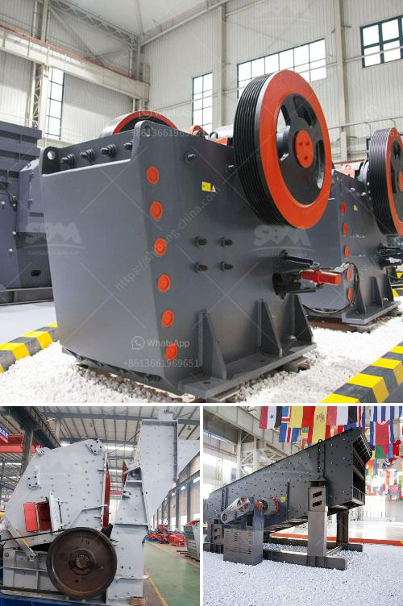

<h3>brand crusher machine in malaysia</h3>
Malaysia is renowned for its diverse range of industries, including mining and manufacturing. These industries require a steady supply of raw materials in order to thrive and meet the demands of the market. One essential piece of equipment utilized in these sectors is the crusher machine. It plays a crucial role in the crushing process, as it efficiently breaks down large rocks or minerals into smaller, more manageable pieces.

When it comes to selecting a brand crusher machine in Malaysia, there are several factors to consider. Durability, reliability, efficiency, and affordability are key features that industry professionals prioritize. One brand that stands out in the Malaysian market is known for delivering superior machines that fulfill all these requirements effortlessly.

This brand crusher machine in Malaysia offers a wide range of primary and secondary crushers for industries such as mining, metallurgy, cement, construction, and more. Its innovative design utilizes the latest technology to ensure high productivity, user-friendly operation, and low maintenance costs. Whether it is a jaw crusher, cone crusher, or impact crusher, this brand offers a comprehensive selection that caters to diverse crushing needs.

Moreover, this brand's crushers incorporate a host of safety features that prioritize the well-being of operators and prevent accidents. Robust construction ensures maximum durability, allowing the machines to withstand harsh working conditions and long-term usage without compromising performance. Furthermore, its efficient design minimizes energy consumption, reducing overall operational costs and promoting sustainability.

In addition to superior performance, this brand also offers excellent after-sales service and support. Buying a crusher machine is a long-term investment, and a reliable brand goes the extra mile to assist customers throughout their ownership journey. From installation and commissioning to regular maintenance and spare parts supply, this brand is committed to ensuring customer satisfaction and prolonging the lifespan of their machinery.

In conclusion, choosing the right brand crusher machine in Malaysia is crucial for any industry looking to optimize its crushing operations. With a range of exceptional crushers designed to meet various requirements, this brand offers a reliable choice for businesses in Malaysia. Whether it is mining, manufacturing, or construction, investing in this brand's crushers ensures high productivity, minimal downtime, and cost-effective crushing solutions.
<h3>Contact us</h3><ul><li><strong>Whatsapp:&nbsp;<a href="https://wa.me/8613661969651">+8613661969651</a></strong></li><li><a href="https://swt.shibang-china.com/?git&amp;zhl&amp;brand crusher machine in malaysia"><strong>Online Service(chat now)</strong></a></li></ul><h3>Related</h3><ul><li><a href='vertical roller mill.md'>vertical roller mill</a></li><li><a href='calculation of crushing plant.md'>calculation of crushing plant</a></li><li><a href='low cost jaw crusher price.md'>low cost jaw crusher price</a></li><li><a href='500 tph jaw crusher for sale.md'>500 tph jaw crusher for sale</a></li><li><a href='automatic stone crusher plant.md'>automatic stone crusher plant</a></li></ul>