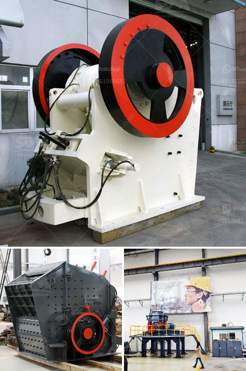

<h3>brand new cone crusher for sale india</h3>
India is rich in various mineral resources and it is an important mineral processing market. With the development of local economy, lots of mineral processing plants are built there. SBM has built our oversea office in India for many years and we have numerous customers in India. India is famous for its rich mineral resources. It has many kinds of mineral ores, such as coal, iron ore, limestone, etc. The main mineral reserves in India are coal, iron, manganese, bauxite, mica, etc. These mineral resources contribute to the economic development in India.

Considering the abundant mineral resources in India, SBM has developed a series of cone crushers for sale. These cone crushers have different specifications and functions. Different cone crusher models can crush different kinds of ores and rocks with various hardness. Cone crusher in India for sale is suitable for both metallic minerals and non-metallic minerals, such as iron ore, nonferrous metal ore, granite, limestone, quartzite, sandstone, pebble, etc. It can be applied to limestone crushing plants, basalt crushing plants, granite crushing plants, marble crushing plants, etc.

The cone crushers are specially engineered to suit all secondary, tertiary and quaternary crushing applications in both stationary and mobile installations. Conveniently, the cone crusher can be divided into four types according to the crushing chamber type: standard, medium, fine and superfine. Each type of cone crusher has their unique crushing ratio, yield particle size, operation cost and wear cost. So cone crusher is also called fine quarry crusher, road construction crusher and rock crusher for sale.

As a professional cone crusher supplier, SBM has designed and developed many cone crusher plant for sale. We have more than 20 years' professional experience in mining machinery production and integration, technical support and maintenance service. We have produced a series of cone crushers for sale to meet different customers' requirements. Our cone crushers are easy to operate and maintain, and they have high reliability and low noise. These features make our cone crushers the best choice for many processing plants in India.

We also provide all types of crushers, such as jaw crusher, impact crusher, VSI crusher, hammer crusher, cone crusher, etc. In a word, SBM provides comprehensive services before, during and after sales. No matter where you are in India, you can get our timely service. With the help of our staff and engineers, you will get the best cone crusher for sale in India.

In conclusion, SBM cone crusher plant is designed to be used in secondary, tertiary or quaternary stage crushing. With high productivity and low operation cost, it is sure to attract more customers' attention. If you are interested, please feel free to contact us for more information. Don't hesitate! The brand new cone crusher for sale in India will bring high profits to customers.
<h3>Contact us</h3><ul><li><strong>Whatsapp:&nbsp;<a href="https://wa.me/8613661969651">+8613661969651</a></strong></li><li><a href="https://swt.shibang-china.com/?git&amp;zhl&amp;brand new cone crusher for sale india"><strong>Online Service(chat now)</strong></a></li></ul><h3>Related</h3><ul><li><a href='overflow type ball mill.md'>overflow type ball mill</a></li><li><a href='granite crushing plants.md'>granite crushing plants</a></li><li><a href='cannabis mechoire cannabis crusher in pakistan.md'>cannabis mechoire cannabis crusher in pakistan</a></li><li><a href='marble crusher machines usa.md'>marble crusher machines usa</a></li><li><a href='cement clinker ball mill.md'>cement clinker ball mill</a></li></ul>