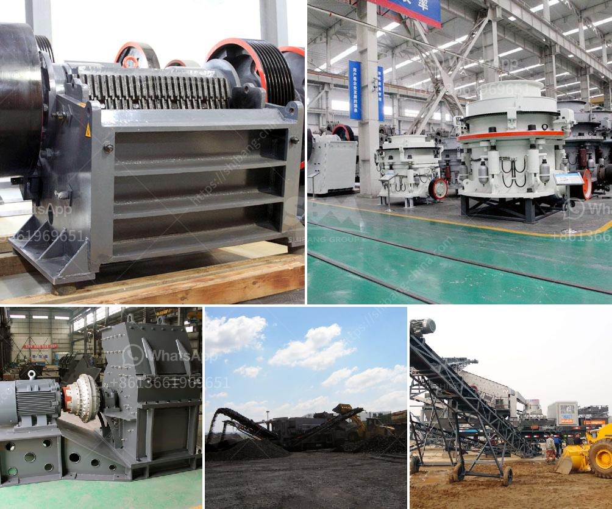

<h3>business plan for small scale gold processing plant</h3>
The small scale gold processing plant is specially designed for the small-scale gold mining miners. The whole plant consists of one hammer crusher, one centrifugal concentrator and one water pump. The plant is very suitable for remote areas because of its simple equipment design, easy maintenance, and convenient operation. With its high recovery rate, the plant has been exported to over 90 countries and regions, and has earned a high reputation from customers.

A business plan is essential before starting any business, including a small scale gold processing plant. The plan should include the following key sections:

1. Executive Summary: This section provides a general overview of the business plan, including the business concept, objectives, target market, and financial highlights.

2. Company Description: Here, you need to provide detailed information about your company, including its name, location, legal structure, and ownership. Describe the history, achievements, and unique selling proposition of your company.

3. Market Analysis: Conduct a thorough analysis of the gold processing industry in your target market. Include information on market size, growth rate, trends, and competition. Identify your target customers and explain how your plant will meet their needs.

4. Product/Service Offering: Describe your gold processing plant in detail. Explain the technology, equipment, and processes involved in the extraction and processing of gold. Highlight the features and benefits that differentiate your plant from competitors.

5. Marketing and Sales Strategy: Outline your marketing and sales plan to attract customers and generate revenue. Identify the marketing channels you will use, such as online advertising, trade shows, and partnerships with local miners. Detail your pricing strategy and sales projections.

6. Operations: Provide information on the location, facilities, and equipment required to run your processing plant. Outline the production process, staffing requirements, and estimated costs. Discuss the regulatory and environmental considerations associated with operating a gold processing plant.

7. Financial Projections: Present a comprehensive financial plan that includes income statements, cash flow projections, and balance sheets. Highlight the initial investment required to set up the plant, as well as the expected return on investment. Include a contingency plan for unforeseen circumstances.

8. Risk Analysis: Identify and assess potential risks and challenges associated with running a gold processing plant. Discuss how you will mitigate these risks and ensure the long-term sustainability of your business.

9. Management and Team: Introduce the key members of your management team and their relevant experience in the gold processing industry. Highlight their roles and responsibilities in the success of the business.

10. Conclusion: Summarize the main points of your business plan and reiterate the potential of your small scale gold processing plant. Emphasize the competitive advantages and growth prospects of your business.

In conclusion, a well-structured business plan is crucial for the successful establishment and operation of a small scale gold processing plant. It provides a roadmap for the future and helps attract investors and lenders. By carefully considering and addressing the key components mentioned above, you can increase the chances of achieving long-term success in the gold processing industry.
<h3>Contact us</h3><ul><li><strong>Whatsapp:&nbsp;<a href="https://wa.me/8613661969651">+8613661969651</a></strong></li><li><a href="https://swt.shibang-china.com/?git&amp;zhl&amp;business plan for small scale gold processing plant"><strong>Online Service(chat now)</strong></a></li></ul><h3>Related</h3><ul><li><a href='limestone ball mill machine.md'>limestone ball mill machine</a></li><li><a href='how to make marble powder statues.md'>how to make marble powder statues</a></li><li><a href='manganese metal production process.md'>manganese metal production process</a></li><li><a href='ball mill calcium.md'>ball mill calcium</a></li><li><a href='silica sand processing plant.md'>silica sand processing plant</a></li></ul>